

# 🏛️ AKADEMİK İŞLETİM SİSTEMİ
### *Mültidisipliner Ustalık — Milyar Dolarlık Bireyler İçin* 💎🚀

---

> **"Geleceğin dünyasını inşa eden 'Mültidisipliner Solopreneur'lar için tasarlanmış, yapay zeka entegreli akademik bir işletim sistemi ve bilgi cephaneliği."** 💎🦾🚀

---

## 🏛️ MİMARİ ŞEMA

```mermaid
graph TD
    A["🏛️ AKADEMİK İŞLETİM SİSTEMİ"] --> B["⚙️ MÜHENDİSLİK"]
    A --> C["🏛️ MİMARLIK & TASARIM"]
    A --> D["🔬 DOĞA BİLİMLERİ"]
    A --> E["🏥 TIP & SAĞLIK"]
    A --> F["⚖️ SOSYAL BİLİMLER"]
    A --> G["📉 İKTİSAT & İŞLETME"]
    A --> H["🚀 GELECEK TEKNOLOJİ"]
    A --> I["🎭 GÜZEL SANATLAR"]
    A --> J["📡 İLETİŞİM"]
    A --> K["⚖️ HUKUK"]
    A --> L["🌾 ZİRAAT & ÇEVRE"]
    A --> M["🎓 EĞİTİM"]
    A --> N["🕌 İLAHİYAT"]
    A --> O["🏃 SPOR"]
    A --> P["🏨 TURİZM"]

    subgraph "Temel Bilimler ve Mühendislik"
        B
        C
        D
    end

    subgraph "Sağlık ve Yaşam"
        E
        L
    end

    subgraph "Toplum ve İnsan"
        F
        G
        K
        J
    end

    subgraph "Vizyon ve Gelecek"
        H
        I
        M
        N
        O
        P
    end
```

---

> **"Kendi imparatorluğunu kurmak için gereken tüm akademik silahlar burada."** ⚔️🔥

---

## 🌌 Yeni Dünya Manifestosu: Mültidisipliner Zeka

Yapay zeka çağında, sadece bir "alan uzmanı" olmak yetersizdir. Gelecek, mühendislik kodunu hukuk etiğiyle, mimari estetiği ekonomik sürdürülebilirlikle birleştiren **"Mültidisipliner Solopreneur"**ların olacaktır.

> **"Geleceği tahmin etmenin tek yolu, onu mültidisipliner bir zekayla bizzat tasarlamaktır."** 🚀

---

## ⚙️ META MÜHENDİSLİK — Tüm Mühendislik Bölümleri

[`meta_muhendislik/`](meta_muhendislik/) klasörü altında **46 mühendislik bölümü** bulunmaktadır:

| Bölüm | Bölüm | Bölüm |
|:---|:---|:---|
| [Adli Bilisim Muhendisligi](meta_muhendislik/adli_bilisim_muhendisligi) | [Bilgisayar Muhendisligi](meta_muhendislik/bilgisayar_muhendisligi) | [Bilisim Sistemleri Muhendisligi](meta_muhendislik/bilisim_sistemleri_muhendisligi) |
| [Biyokimya Muhendisligi](meta_muhendislik/biyokimya_muhendisligi) | [Biyomedikal Muhendisligi](meta_muhendislik/biyomedikal_muhendisligi) | [Biyosistem Muhendisligi](meta_muhendislik/biyosistem_muhendisligi) |
| [Cevre Muhendisligi](meta_muhendislik/cevre_muhendisligi) | [Deniz Ulastirma Isletme Muhendisligi](meta_muhendislik/deniz_ulastirma_isletme_muhendisligi) | [Elektrik Elektronik Muhendisligi](meta_muhendislik/elektrik_elektronik_muhendisligi) |
| [Elektronik Ve Haberlesme Muhendisligi](meta_muhendislik/elektronik_ve_haberlesme_muhendisligi) | [Endustri Muhendisligi](meta_muhendislik/endustri_muhendisligi) | [Endustriyel Tasarim Muhendisligi](meta_muhendislik/endustriyel_tasarim_muhendisligi) |
| [Enerji Sistemleri Muhendisligi](meta_muhendislik/enerji_sistemleri_muhendisligi) | [Fizik Muhendisligi](meta_muhendislik/fizik_muhendisligi) | [Gemi Insaati Ve Gemi Makineleri Muhendisligi](meta_muhendislik/gemi_insaati_ve_gemi_makineleri_muhendisligi) |
| [Gemi Makineleri Isletme Muhendisligi](meta_muhendislik/gemi_makineleri_isletme_muhendisligi) | [Geomatik Muhendisligi](meta_muhendislik/geomatik_muhendisligi) | [Gida Muhendisligi](meta_muhendislik/gida_muhendisligi) |
| [Harita Muhendisligi](meta_muhendislik/harita_muhendisligi) | [Havacilik Ve Uzay Muhendisligi](meta_muhendislik/havacilik_ve_uzay_muhendisligi) | [Imalat Muhendisligi](meta_muhendislik/imalat_muhendisligi) |
| [Insaat Muhendisligi](meta_muhendislik/insaat_muhendisligi) | [Insaat Teknolojisi Muhendisligi](meta_muhendislik/insaat_teknolojisi_muhendisligi) | [Isletme Muhendisligi](meta_muhendislik/isletme_muhendisligi) |
| [Jeofizik Muhendisligi](meta_muhendislik/jeofizik_muhendisligi) | [Jeoloji Muhendisligi](meta_muhendislik/jeoloji_muhendisligi) | [Kimya Muhendisligi](meta_muhendislik/kimya_muhendisligi) |
| [Kontrol Ve Otomasyon Muhendisligi](meta_muhendislik/kontrol_ve_otomasyon_muhendisligi) | [Maden Muhendisligi](meta_muhendislik/maden_muhendisligi) | [Makine Muhendisligi](meta_muhendislik/makine_muhendisligi) |
| [Matematik Muhendisligi](meta_muhendislik/matematik_muhendisligi) | [Mekatronik Muhendisligi](meta_muhendislik/mekatronik_muhendisligi) | [Metalurji Ve Malzeme Muhendisligi](meta_muhendislik/metalurji_ve_malzeme_muhendisligi) |
| [Nanoteknoloji Muhendisligi](meta_muhendislik/nanoteknoloji_muhendisligi) | [Nukleer Enerji Muhendisligi](meta_muhendislik/nukleer_enerji_muhendisligi) | [Orman Muhendisligi](meta_muhendislik/orman_muhendisligi) |
| [Otomotiv Muhendisligi](meta_muhendislik/otomotiv_muhendisligi) | [Siber Guvenlik Muhendisligi](meta_muhendislik/siber_guvenlik_muhendisligi) | [Su Urunleri Muhendisligi](meta_muhendislik/su_urunleri_muhendisligi) |
| [Tarim Makineleri Ve Teknolojileri Muhendisligi](meta_muhendislik/tarim_makineleri_ve_teknolojileri_muhendisligi) | [Tekstil Muhendisligi](meta_muhendislik/tekstil_muhendisligi) | [Tekstil Teknolojisi Muhendisligi](meta_muhendislik/tekstil_teknolojisi_muhendisligi) |
| [Ucak Muhendisligi](meta_muhendislik/ucak_muhendisligi) | [Yapay Zeka Ve Veri Muhendisligi](meta_muhendislik/yapay_zeka_ve_veri_muhendisligi) | [Yazilim Muhendisligi](meta_muhendislik/yazilim_muhendisligi) |
| [Ziraat Muhendisligi](meta_muhendislik/ziraat_muhendisligi) |  |  |

---

## ⚙️ META MÜHENDİSLİK — Tüm Mühendislik Bölümleri

[`meta_muhendislik/`](meta_muhendislik/) altında **46 mühendislik bölümü**:

| Bölüm | Bölüm | Bölüm |
|:---|:---|:---|
| [Adli Bilisim Muhendisligi](meta_muhendislik/adli_bilisim_muhendisligi) | [Bilgisayar Muhendisligi](meta_muhendislik/bilgisayar_muhendisligi) | [Bilisim Sistemleri Muhendisligi](meta_muhendislik/bilisim_sistemleri_muhendisligi) |
| [Biyokimya Muhendisligi](meta_muhendislik/biyokimya_muhendisligi) | [Biyomedikal Muhendisligi](meta_muhendislik/biyomedikal_muhendisligi) | [Biyosistem Muhendisligi](meta_muhendislik/biyosistem_muhendisligi) |
| [Cevre Muhendisligi](meta_muhendislik/cevre_muhendisligi) | [Deniz Ulastirma Isletme Muhendisligi](meta_muhendislik/deniz_ulastirma_isletme_muhendisligi) | [Elektrik Elektronik Muhendisligi](meta_muhendislik/elektrik_elektronik_muhendisligi) |
| [Elektronik Ve Haberlesme Muhendisligi](meta_muhendislik/elektronik_ve_haberlesme_muhendisligi) | [Endustri Muhendisligi](meta_muhendislik/endustri_muhendisligi) | [Endustriyel Tasarim Muhendisligi](meta_muhendislik/endustriyel_tasarim_muhendisligi) |
| [Enerji Sistemleri Muhendisligi](meta_muhendislik/enerji_sistemleri_muhendisligi) | [Fizik Muhendisligi](meta_muhendislik/fizik_muhendisligi) | [Gemi Insaati Ve Gemi Makineleri Muhendisligi](meta_muhendislik/gemi_insaati_ve_gemi_makineleri_muhendisligi) |
| [Gemi Makineleri Isletme Muhendisligi](meta_muhendislik/gemi_makineleri_isletme_muhendisligi) | [Geomatik Muhendisligi](meta_muhendislik/geomatik_muhendisligi) | [Gida Muhendisligi](meta_muhendislik/gida_muhendisligi) |
| [Harita Muhendisligi](meta_muhendislik/harita_muhendisligi) | [Havacilik Ve Uzay Muhendisligi](meta_muhendislik/havacilik_ve_uzay_muhendisligi) | [Imalat Muhendisligi](meta_muhendislik/imalat_muhendisligi) |
| [Insaat Muhendisligi](meta_muhendislik/insaat_muhendisligi) | [Insaat Teknolojisi Muhendisligi](meta_muhendislik/insaat_teknolojisi_muhendisligi) | [Isletme Muhendisligi](meta_muhendislik/isletme_muhendisligi) |
| [Jeofizik Muhendisligi](meta_muhendislik/jeofizik_muhendisligi) | [Jeoloji Muhendisligi](meta_muhendislik/jeoloji_muhendisligi) | [Kimya Muhendisligi](meta_muhendislik/kimya_muhendisligi) |
| [Kontrol Ve Otomasyon Muhendisligi](meta_muhendislik/kontrol_ve_otomasyon_muhendisligi) | [Maden Muhendisligi](meta_muhendislik/maden_muhendisligi) | [Makine Muhendisligi](meta_muhendislik/makine_muhendisligi) |
| [Matematik Muhendisligi](meta_muhendislik/matematik_muhendisligi) | [Mekatronik Muhendisligi](meta_muhendislik/mekatronik_muhendisligi) | [Metalurji Ve Malzeme Muhendisligi](meta_muhendislik/metalurji_ve_malzeme_muhendisligi) |
| [Nanoteknoloji Muhendisligi](meta_muhendislik/nanoteknoloji_muhendisligi) | [Nukleer Enerji Muhendisligi](meta_muhendislik/nukleer_enerji_muhendisligi) | [Orman Muhendisligi](meta_muhendislik/orman_muhendisligi) |
| [Otomotiv Muhendisligi](meta_muhendislik/otomotiv_muhendisligi) | [Siber Guvenlik Muhendisligi](meta_muhendislik/siber_guvenlik_muhendisligi) | [Su Urunleri Muhendisligi](meta_muhendislik/su_urunleri_muhendisligi) |
| [Tarim Makineleri Ve Teknolojileri Muhendisligi](meta_muhendislik/tarim_makineleri_ve_teknolojileri_muhendisligi) | [Tekstil Muhendisligi](meta_muhendislik/tekstil_muhendisligi) | [Tekstil Teknolojisi Muhendisligi](meta_muhendislik/tekstil_teknolojisi_muhendisligi) |
| [Ucak Muhendisligi](meta_muhendislik/ucak_muhendisligi) | [Yapay Zeka Ve Veri Muhendisligi](meta_muhendislik/yapay_zeka_ve_veri_muhendisligi) | [Yazilim Muhendisligi](meta_muhendislik/yazilim_muhendisligi) |
| [Ziraat Muhendisligi](meta_muhendislik/ziraat_muhendisligi) |  |  |

---

## 🎓 ÖĞRETMENLİK — Tüm Öğretmenlik Programları

[`ogretmenlik/`](ogretmenlik/) altında **13 öğretmenlik programı**:

| Bölüm | Bölüm | Bölüm |
|:---|:---|:---|
| [Beden Egitimi Ve Spor Ogretmenligi](ogretmenlik/beden_egitimi_ve_spor_ogretmenligi) | [Din Kulturu Ve Ahlak Bilgisi Ogretmenligi](ogretmenlik/din_kulturu_ve_ahlak_bilgisi_ogretmenligi) | [Fen Bilgisi Ogretmenligi](ogretmenlik/fen_bilgisi_ogretmenligi) |
| [Ilkogretim Matematik Ogretmenligi](ogretmenlik/ilkogretim_matematik_ogretmenligi) | [Ingilizce Ogretmenligi](ogretmenlik/ingilizce_ogretmenligi) | [Muzik Ogretmenligi](ogretmenlik/muzik_ogretmenligi) |
| [Okul Oncesi Ogretmenligi](ogretmenlik/okul_oncesi_ogretmenligi) | [Ozel Egitim Ogretmenligi](ogretmenlik/ozel_egitim_ogretmenligi) | [Resim Is Ogretmenligi](ogretmenlik/resim_is_ogretmenligi) |
| [Saglik Bilgisi Ogretmenligi](ogretmenlik/saglik_bilgisi_ogretmenligi) | [Sinif Ogretmenligi](ogretmenlik/sinif_ogretmenligi) | [Sosyal Bilgiler Ogretmenligi](ogretmenlik/sosyal_bilgiler_ogretmenligi) |
| [Turkce Ogretmenligi](ogretmenlik/turkce_ogretmenligi) |  |  |

---

## 🏛️ DİĞER BÖLÜMLER

Mühendislik ve öğretmenlik dışındaki tüm bölümler (alfabetik):

| Bölüm | Bölüm | Bölüm |
|:---|:---|:---|
| [Acil Yardim Ve Afet Yonetimi](acil_yardim_ve_afet_yonetimi) | [Alman Dili Ve Edebiyati](alman_dili_ve_edebiyati) | [Ameliyathane Hizmetleri](ameliyathane_hizmetleri) |
| [Anestezi Ve Reanimasyon](anestezi_ve_reanimasyon) | [Antrenorluk Egitimi](antrenorluk_egitimi) | [Antropoloji](antropoloji) |
| [Arap Dili Ve Edebiyati](arap_dili_ve_edebiyati) | [Arkeoloji](arkeoloji) | [Astronomi Ve Uzay Bilimleri](astronomi_ve_uzay_bilimleri) |
| [Beden Egitimi Ve Spor Bilimleri](beden_egitimi_ve_spor_bilimleri) | [Beslenme Ve Diyetetik](beslenme_ve_diyetetik) | [Bilgisayar Ve Ogretim Teknolojileri Egitimi](bilgisayar_ve_ogretim_teknolojileri_egitimi) |
| [Biyoistatistik](biyoistatistik) | [Biyoloji](biyoloji) | [Calisma Ekonomisi Ve Endustri Iliskileri](calisma_ekonomisi_ve_endustri_iliskileri) |
| [Cizgi Film Ve Animasyon](cizgi_film_ve_animasyon) | [Cocuk Gelisimi](cocuk_gelisimi) | [Cografya](cografya) |
| [Dil Ve Konusma Terapisi](dil_ve_konusma_terapisi) | [Dilbilim](dilbilim) | [Dis Hekimligi](dis_hekimligi) |
| [Dis Ticaret](dis_ticaret) | [Ebelik](ebelik) | [Eczacilik](eczacilik) |
| [Ekonometri](ekonometri) | [Ekonomi](ekonomi) | [Endustriyel Tasarim](endustriyel_tasarim) |
| [Enerji Yonetimi](enerji_yonetimi) | [Ergoterapi](ergoterapi) | [Felsefe](felsefe) |
| [Fizik](fizik) | [Fizyoterapi Ve Rehabilitasyon](fizyoterapi_ve_rehabilitasyon) | [Fransiz Dili Ve Edebiyati](fransiz_dili_ve_edebiyati) |
| [Gastronomi Ve Mutfak Sanatlari](gastronomi_ve_mutfak_sanatlari) | [Gazetecilik](gazetecilik) | [Gerontoloji](gerontoloji) |
| [Girisimcilik](girisimcilik) | [Gorsel Iletisim Tasarimi](gorsel_iletisim_tasarimi) | [Grafik Tasarimi](grafik_tasarimi) |
| [Halkla Iliskiler Ve Reklamcilik](halkla_iliskiler_ve_reklamcilik) | [Havacilik Yonetimi](havacilik_yonetimi) | [Hemsirelik](hemsirelik) |
| [Hukuk](hukuk) | [Ic Mimarlik Ve Cevre Tasarimi](ic_mimarlik_ve_cevre_tasarimi) | [Iktisat](iktisat) |
| [Ilahiyat](ilahiyat) | [Ingiliz Dili Ve Edebiyati](ingiliz_dili_ve_edebiyati) | [Insan Kaynaklari Yonetimi](insan_kaynaklari_yonetimi) |
| [Isletme](isletme) | [Istatistik](istatistik) | [Jeoloji](jeoloji) |
| [Kimya](kimya) | [Konaklama Isletmeciligi](konaklama_isletmeciligi) | [Kultur Varliklarini Koruma Ve Onarim](kultur_varliklarini_koruma_ve_onarim) |
| [Kuyumculuk Ve Mucevher Tasarimi](kuyumculuk_ve_mucevher_tasarimi) | [Lojistik Yonetimi](lojistik_yonetimi) | [Maliye](maliye) |
| [Matematik](matematik) | [Mimarlik](mimarlik) | [Molekuler Biyoloji Ve Genetik](molekuler_biyoloji_ve_genetik) |
| [Muhasebe Ve Finans Yonetimi](muhasebe_ve_finans_yonetimi) | [Mutercim Ve Tercumanlik](mutercim_ve_tercumanlik) | [Muzik](muzik) |
| [Odyoloji](odyoloji) | [Ozurluluk Calismalari](ozurluluk_calismalari) | [Peyzaj Mimarligi](peyzaj_mimarligi) |
| [Psikoloji](psikoloji) | [Radyo Televizyon Ve Sinema](radyo_televizyon_ve_sinema) | [Rehberlik Ve Psikolojik Danismanlik](rehberlik_ve_psikolojik_danismanlik) |
| [Rekreasyon](rekreasyon) | [Rus Dili Ve Edebiyati](rus_dili_ve_edebiyati) | [Saglik Yonetimi](saglik_yonetimi) |
| [Sanat Tarihi](sanat_tarihi) | [Sehir Ve Bolge Planlama](sehir_ve_bolge_planlama) | [Seramik Ve Cam Tasarimi](seramik_ve_cam_tasarimi) |
| [Sigortacilik Ve Risk Yonetimi](sigortacilik_ve_risk_yonetimi) | [Siyaset Bilimi Ve Kamu Yonetimi](siyaset_bilimi_ve_kamu_yonetimi) | [Sosyal Hizmet](sosyal_hizmet) |
| [Sosyoloji](sosyoloji) | [Spor Yoneticiligi](spor_yoneticiligi) | [Tarih](tarih) |
| [Tekstil Ve Moda Tasarimi](tekstil_ve_moda_tasarimi) | [Tibbi Goruntuleme Teknikleri](tibbi_goruntuleme_teknikleri) | [Tibbi Laboratuvar Teknikleri](tibbi_laboratuvar_teknikleri) |
| [Tip](tip) | [Tiyatro Oyunculuk](tiyatro_oyunculuk) | [Turizm Isletmeciligi](turizm_isletmeciligi) |
| [Turizm Rehberligi](turizm_rehberligi) | [Turk Dili Ve Edebiyati](turk_dili_ve_edebiyati) | [Uluslararasi Iliskiler](uluslararasi_iliskiler) |
| [Uluslararasi Ticaret Ve Lojistik](uluslararasi_ticaret_ve_lojistik) | [Veterinerlik](veterinerlik) | [Yeni Medya Ve Iletisim](yeni_medya_ve_iletisim) |
| [Yiyecek Icecek Isletmeciligi](yiyecek_icecek_isletmeciligi) | [Yonetim Bilisim Sistemleri](yonetim_bilisim_sistemleri) |  |

---

## 🔍 ÖZEL ARAŞTIRMA VE İLERİ UZMANLIK ALANLARI

Lisans bölümü formatında olmayan; araştırma ve lisansüstü odak alanları:

| Bölüm | Bölüm | Bölüm |
|:---|:---|:---|
| [3D Print Ai](ozel_arastirma_alanlari/3d_print_ai) | [Akustik Muhendisligi](ozel_arastirma_alanlari/akustik_muhendisligi) | [Artirilmis Gerceklik Muhendisligi](ozel_arastirma_alanlari/artirilmis_gerceklik_muhendisligi) |
| [Bci](ozel_arastirma_alanlari/bci) | [Biyoteknik Nanotip](ozel_arastirma_alanlari/biyoteknik_nanotip) | [Contex Engineering](ozel_arastirma_alanlari/contex_engineering) |
| [Egitim Yonetimi](ozel_arastirma_alanlari/egitim_yonetimi) | [Finans Muhendisligi](ozel_arastirma_alanlari/finans_muhendisligi) | [Fintek Ai](ozel_arastirma_alanlari/fintek_ai) |
| [Fotografcilik Ve Video](ozel_arastirma_alanlari/fotografcilik_ve_video) | [Guzel Sanatlar](ozel_arastirma_alanlari/guzel_sanatlar) | [Hukuk Ve Ai Etigi](ozel_arastirma_alanlari/hukuk_ve_ai_etigi) |
| [Kuantum Muhendisligi](ozel_arastirma_alanlari/kuantum_muhendisligi) | [Metaverse](ozel_arastirma_alanlari/metaverse) | [Muhendislik Ortak](ozel_arastirma_alanlari/muhendislik_ortak) |
| [Nanoteknoloji Ai](ozel_arastirma_alanlari/nanoteknoloji_ai) | [Noro Muhendisligi](ozel_arastirma_alanlari/noro_muhendisligi) | [Optik Muhendisligi](ozel_arastirma_alanlari/optik_muhendisligi) |
| [Patlayici Muhendisligi](ozel_arastirma_alanlari/patlayici_muhendisligi) |  |  |

---

## 🧬 Mültidisipliner Sinerji Matrisi

| Alan A | Alan B | 🚀 Sinerji Sonucu |
| :--- | :--- | :--- |
| **Yazılım** | **Hukuk** | Akıllı sözleşmeler ve regülasyon uyumlu otonom sistemler. |
| **Mimarlık** | **Yapay Zeka** | Üretken tasarım (Generative Design) ve nöro-mimari mekanlar. |
| **Mühendislik** | **İktisat** | Maliyet optimizasyonlu otonom üretim tesisleri. |
| **Sosyoloji** | **Veri Bilimi** | Toplumsal davranış tahminleme ve dijital topluluk mühendisliği. |
| **Eğitim** | **AI** | Kişiselleştirilmiş öğrenme sistemleri ve adaptif pedagoji. |
| **Sağlık** | **Kuantum** | Kuantum tıp görüntüleme ve ilaç keşfi. |

---

## 🛠️ Solopreneur AI Araç Seti (V.2025)

> [!TIP]
> **"Harika bir zanaatkar, aletlerini en iyi tanıyan kişidir."**

### 🧠 Düşünce ve Strateji
- **Problem Çözme:** [Gemini 2.0 / GPT-o1] - Karmaşık analizler.
- **Veri Analizi:** [Claude 3.5 Sonnet] - Kod ve görselleştirme.
- **Akademik Araştırma:** [Perplexity AI] - Gerçek zamanlı bilgi.

### 🎨 Tasarım ve Estetik
- **Mimari & Görsel:** [Midjourney v6.1]
- **UI/UX:** [v0.dev / Figma AI]

### ⚙️ Operasyon ve Üretim
- **Otomasyon:** [Make.com / n8n]
- **Yazılım:** [Cursor / Windsurf]

---

## 🗺️ Gelecek Yol Haritası

- [ ] **Derinlemesine Ders Notları:** Her bölüm altına 101 ve ileri seviye ders içerikleri.
- [ ] **Interactive Playground:** Simülasyon araçları ve kod ortamları.
- [ ] **AI Entegrasyonu:** Her bölüme AI destekli özet ve soru-cevap eklentisi.

> **"Bilgi paylaşıldıkça çoğalır, mültidisipliner hale geldikçe güçlenir."** 🌐

---

## 🤝 Katkıda Bulunma

1. Bir **Issue** açın.
2. [`CONTRIBUTING.md`](CONTRIBUTING.md) dosyasını okuyun.
3. Kendi **Pull Request**inizi gönderin!

---

## ⚖️ Lisans

Bu repo **MIT Lisansı** ile korunmaktadır. Detaylar için [`LICENSE`](LICENSE) dosyasına bakın.

**Hazırlayan:** Bahattin Yunus Çetin  
*Mühendis & Araştırmacı*

[Linkedin](https://linkedin.com/in/bahattinyunuscetin) | [GitHub](https://github.com/bahattinyunus)

