

# 🏛️ AKADEMİK İŞLETİM SİSTEMİ
### *Mültidisipliner Ustalık — Milyar Dolarlık Bireyler İçin* 💎🚀

---

> **"Geleceğin dünyasını inşa eden 'Mültidisipliner Solopreneur'lar için tasarlanmış, yapay zeka entegreli akademik bir işletim sistemi ve bilgi cephaneliği."** 💎🦾🚀

---

## 🏛️ MİMARİ ŞEMA

```mermaid
graph TD
    A["🏛️ AKADEMİK İŞLETİM SİSTEMİ"] --> B["⚙️ MÜHENDİSLİK"]
    A --> C["🏛️ MİMARLIK & TASARIM"]
    A --> D["🔬 DOĞA BİLİMLERİ"]
    A --> E["🏥 TIP & SAĞLIK"]
    A --> F["⚖️ SOSYAL BİLİMLER"]
    A --> G["📉 İKTİSAT & İŞLETME"]
    A --> H["🚀 GELECEK TEKNOLOJİ"]
    A --> I["🎭 GÜZEL SANATLAR"]
    A --> J["📡 İLETİŞİM"]
    A --> K["⚖️ HUKUK"]
    A --> L["🌾 ZİRAAT & ÇEVRE"]
    A --> M["🎓 EĞİTİM"]
    A --> N["🕌 İLAHİYAT"]
    A --> O["🏃 SPOR"]
    A --> P["🏨 TURİZM"]

    subgraph "Temel Bilimler ve Mühendislik"
        B
        C
        D
    end

    subgraph "Sağlık ve Yaşam"
        E
        L
    end

    subgraph "Toplum ve İnsan"
        F
        G
        K
        J
    end

    subgraph "Vizyon ve Gelecek"
        H
        I
        M
        N
        O
        P
    end
```

---

> **"Kendi imparatorluğunu kurmak için gereken tüm akademik silahlar burada."** ⚔️🔥

---

## 🌌 Yeni Dünya Manifestosu: Mültidisipliner Zeka

Yapay zeka çağında, sadece bir "alan uzmanı" olmak yetersizdir. Gelecek, mühendislik kodunu hukuk etiğiyle, mimari estetiği ekonomik sürdürülebilirlikle birleştiren **"Mültidisipliner Solopreneur"**ların olacaktır.

> **"Geleceği tahmin etmenin tek yolu, onu mültidisipliner bir zekayla bizzat tasarlamaktır."** 🚀

---

## 🎓 BÖLÜMLER

Birim bazlı sınıflandırma olmaksızın, alfabetik sıraya göre YÖK standartlarındaki tam bölümler:

| Bölüm | Bölüm | Bölüm |
|:---|:---|:---|
| [Adli Bilisim Muhendisligi](adli_bilisim_muhendisligi) | [Antrenorluk Egitimi](antrenorluk_egitimi) | [Antropoloji](antropoloji) |
| [Astronomi Ve Uzay Bilimleri](astronomi_ve_uzay_bilimleri) | [Beden Egitimi Ve Spor Ogretmenligi](beden_egitimi_ve_spor_ogretmenligi) | [Beslenme Ve Diyetetik](beslenme_ve_diyetetik) |
| [Bilgisayar Mühendisligi](bilgisayar_mühendisligi) | [Bilgisayar Ve Ogretim Teknolojileri Egitimi](bilgisayar_ve_ogretim_teknolojileri_egitimi) | [Bilisim Sistemleri Muhendisligi](bilisim_sistemleri_muhendisligi) |
| [Biyoloji](biyoloji) | [Biyomedikal Mühendisligi](biyomedikal_mühendisligi) | [Biyosistem Muhendisligi](biyosistem_muhendisligi) |
| [Cevre Muhendisligi](cevre_muhendisligi) | [Cografya](cografya) | [Dilbilim](dilbilim) |
| [Din Kulturu Ve Ahlak Bilgisi Ogretmenligi](din_kulturu_ve_ahlak_bilgisi_ogretmenligi) | [Dis Hekimligi](dis_hekimligi) | [Eczacilik](eczacilik) |
| [Ekonomi](ekonomi) | [Elektrik Elektronik Muhendisligi](elektrik_elektronik_muhendisligi) | [Elektronik Ve Haberlesme Muhendisligi](elektronik_ve_haberlesme_muhendisligi) |
| [Endustri Muhendisligi](endustri_muhendisligi) | [Endustriyel Tasarim Muhendisligi](endustriyel_tasarim_muhendisligi) | [Enerji Sistemleri Muhendisligi](enerji_sistemleri_muhendisligi) |
| [Felsefe](felsefe) | [Fen Bilgisi Ogretmenligi](fen_bilgisi_ogretmenligi) | [Fizik](fizik) |
| [Fizyoterapi Ve Rehabilitasyon](fizyoterapi_ve_rehabilitasyon) | [Gastronomi Ve Mutfak Sanatlari](gastronomi_ve_mutfak_sanatlari) | [Gazetecilik](gazetecilik) |
| [Gida Muhendisligi](gida_muhendisligi) | [Gorsel Iletisim Tasarimi](gorsel_iletisim_tasarimi) | [Halkla Iliskiler Ve Reklamcilik](halkla_iliskiler_ve_reklamcilik) |
| [Harita Muhendisligi](harita_muhendisligi) | [Havacilik Ve Uzay Muhendisligi](havacilik_ve_uzay_muhendisligi) | [Hemsirelik](hemsirelik) |
| [Hukuk](hukuk) | [Ic Mimarlik Ve Cevre Tasarimi](ic_mimarlik_ve_cevre_tasarimi) | [Iktisat](iktisat) |
| [Ilahiyat](ilahiyat) | [Ilkogretim Matematik Ogretmenligi](ilkogretim_matematik_ogretmenligi) | [Imalat Muhendisligi](imalat_muhendisligi) |
| [Insaat Muhendisligi](insaat_muhendisligi) | [Istatistik](istatistik) | [Işletme](işletme) |
| [Jeoloji Muhendisligi](jeoloji_muhendisligi) | [Kimya](kimya) | [Kimya Muhendisligi](kimya_muhendisligi) |
| [Konaklama Isletmeciligi](konaklama_isletmeciligi) | [Kontrol Ve Otomasyon Muhendisligi](kontrol_ve_otomasyon_muhendisligi) | [Kultur Varliklarini Koruma Ve Onarim](kultur_varliklarini_koruma_ve_onarim) |
| [Maden Muhendisligi](maden_muhendisligi) | [Makine Muhendisligi](makine_muhendisligi) | [Maliye](maliye) |
| [Matematik](matematik) | [Mekatronik Muhendisligi](mekatronik_muhendisligi) | [Metalurji Ve Malzeme Muhendisligi](metalurji_ve_malzeme_muhendisligi) |
| [Mimarlik](mimarlik) | [Moda Ve Tekstil Tasarimi](moda_ve_tekstil_tasarimi) | [Molekuler Biyoloji Ve Genetik](molekuler_biyoloji_ve_genetik) |
| [Muzik](muzik) | [Nanoteknoloji Muhendisligi](nanoteknoloji_muhendisligi) | [Orman Muhendisligi](orman_muhendisligi) |
| [Peyzaj Mimarligi](peyzaj_mimarligi) | [Psikoloji](psikoloji) | [Radyo Televizyon Ve Sinema](radyo_televizyon_ve_sinema) |
| [Rehberlik Ve Psikolojik Danismanlik](rehberlik_ve_psikolojik_danismanlik) | [Rekreasyon](rekreasyon) | [Saglik Yonetimi](saglik_yonetimi) |
| [Sehir Ve Bolge Planlama](sehir_ve_bolge_planlama) | [Sinif Ogretmenligi](sinif_ogretmenligi) | [Siyaset Bilimi Ve Kamu Yonetimi](siyaset_bilimi_ve_kamu_yonetimi) |
| [Sosyoloji](sosyoloji) | [Spor Yoneticiligi](spor_yoneticiligi) | [Su Urunleri Muhendisligi](su_urunleri_muhendisligi) |
| [Tarih](tarih) | [Tekstil Muhendisligi](tekstil_muhendisligi) | [Tip](tip) |
| [Turizm Isletmeciligi](turizm_isletmeciligi) | [Uluslararasi Iliskiler](uluslararasi_iliskiler) | [Yapay Zeka Ve Veri Muhendisligi](yapay_zeka_ve_veri_muhendisligi) |
| [Yazilim Muhendisligi](yazilim_muhendisligi) | [Yeni Medya Ve Iletisim](yeni_medya_ve_iletisim) | [Ziraat Muhendisligi](ziraat_muhendisligi) |

---

## 🔍 ÖZEL ARAŞTIRMA VE İLERİ UZMANLIK ALANLARI

Doğrudan lisans bölümü formatında olmayan ancak spesifik teknoloji alanları, lisansüstü programlar veya araştırma başlıkları (örneğin BCI, vb.):

| Özel Alan | Özel Alan | Özel Alan |
|:---|:---|:---|
| [3D Print Ai](ozel_arastirma_alanlari/3d_print_ai) | [Akustik Muhendisligi](ozel_arastirma_alanlari/akustik_muhendisligi) | [Artırılmıs Gerceklik Muhendisligi](ozel_arastirma_alanlari/artırılmıs_gerceklik_muhendisligi) |
| [Bci](ozel_arastirma_alanlari/bci) | [Biyoteknik Nanotıp](ozel_arastirma_alanlari/biyoteknik_nanotıp) | [Contex Engineering](ozel_arastirma_alanlari/contex_engineering) |
| [Egitim Yonetimi](ozel_arastirma_alanlari/egitim_yonetimi) | [Finans Muhendisligi](ozel_arastirma_alanlari/finans_muhendisligi) | [Fintek Ai](ozel_arastirma_alanlari/fintek_ai) |
| [Guzel Sanatlar](ozel_arastirma_alanlari/guzel_sanatlar) | [Hukuk Ve Ai Etigi](ozel_arastirma_alanlari/hukuk_ve_ai_etigi) | [Kuantum Muhendisligi](ozel_arastirma_alanlari/kuantum_muhendisligi) |
| [Metaverse](ozel_arastirma_alanlari/metaverse) | [Mühendislik Ortak](ozel_arastirma_alanlari/mühendislik_ortak) | [Nanoteknoloji Ai](ozel_arastirma_alanlari/nanoteknoloji_ai) |
| [Nöro Muhendisligi](ozel_arastirma_alanlari/nöro_muhendisligi) | [Optik Muhendisligi](ozel_arastirma_alanlari/optik_muhendisligi) | [Patlayıcı Muhendisligi](ozel_arastirma_alanlari/patlayıcı_muhendisligi) |

---

## 🧬 Mültidisipliner Sinerji Matrisi

| Alan A | Alan B | 🚀 Sinerji Sonucu |
| :--- | :--- | :--- |
| **Yazılım** | **Hukuk** | Akıllı sözleşmeler ve regülasyon uyumlu otonom sistemler. |
| **Mimarlık** | **Yapay Zeka** | Üretken tasarım (Generative Design) ve nöro-mimari mekanlar. |
| **Mühendislik** | **İktisat** | Maliyet optimizasyonlu otonom üretim tesisleri. |
| **Sosyoloji** | **Veri Bilimi** | Toplumsal davranış tahminleme ve dijital topluluk mühendisliği. |
| **Eğitim** | **AI** | Kişiselleştirilmiş öğrenme sistemleri ve adaptif pedagoji. |
| **Sağlık** | **Kuantum** | Kuantum tıp görüntüleme ve ilaç keşfi. |

---

## 🛠️ Solopreneur AI Araç Seti (V.2025)

> [!TIP]
> **"Harika bir zanaatkar, aletlerini en iyi tanıyan kişidir."**

### 🧠 Düşünce ve Strateji
- **Problem Çözme:** [Gemini 2.0 / GPT-o1] - Karmaşık analizler.
- **Veri Analizi:** [Claude 3.5 Sonnet] - Kod ve görselleştirme.
- **Akademik Araştırma:** [Perplexity AI] - Gerçek zamanlı bilgi.

### 🎨 Tasarım ve Estetik
- **Mimari & Görsel:** [Midjourney v6.1]
- **UI/UX:** [v0.dev / Figma AI]

### ⚙️ Operasyon ve Üretim
- **Otomasyon:** [Make.com / n8n]
- **Yazılım:** [Cursor / Windsurf]

---

## 🗺️ Gelecek Yol Haritası

- [ ] **Derinlemesine Ders Notları:** Her bölüm altına 101 ve ileri seviye ders içerikleri.
- [ ] **Interactive Playground:** Simülasyon araçları ve kod ortamları.
- [ ] **AI Entegrasyonu:** Her bölüme AI destekli özet ve soru-cevap eklentisi.

> **"Bilgi paylaşıldıkça çoğalır, mültidisipliner hale geldikçe güçlenir."** 🌐

---

## 🤝 Katkıda Bulunma

1. Bir **Issue** açın.
2. [`CONTRIBUTING.md`](CONTRIBUTING.md) dosyasını okuyun.
3. Kendi **Pull Request**inizi gönderin!

---

## ⚖️ Lisans

Bu repo **MIT Lisansı** ile korunmaktadır. Detaylar için [`LICENSE`](LICENSE) dosyasına bakın.

**Hazırlayan:** Bahattin Yunus Çetin  
*Mühendis & Araştırmacı*

[Linkedin](https://linkedin.com/in/bahattinyunuscetin) | [GitHub](https://github.com/bahattinyunus)

