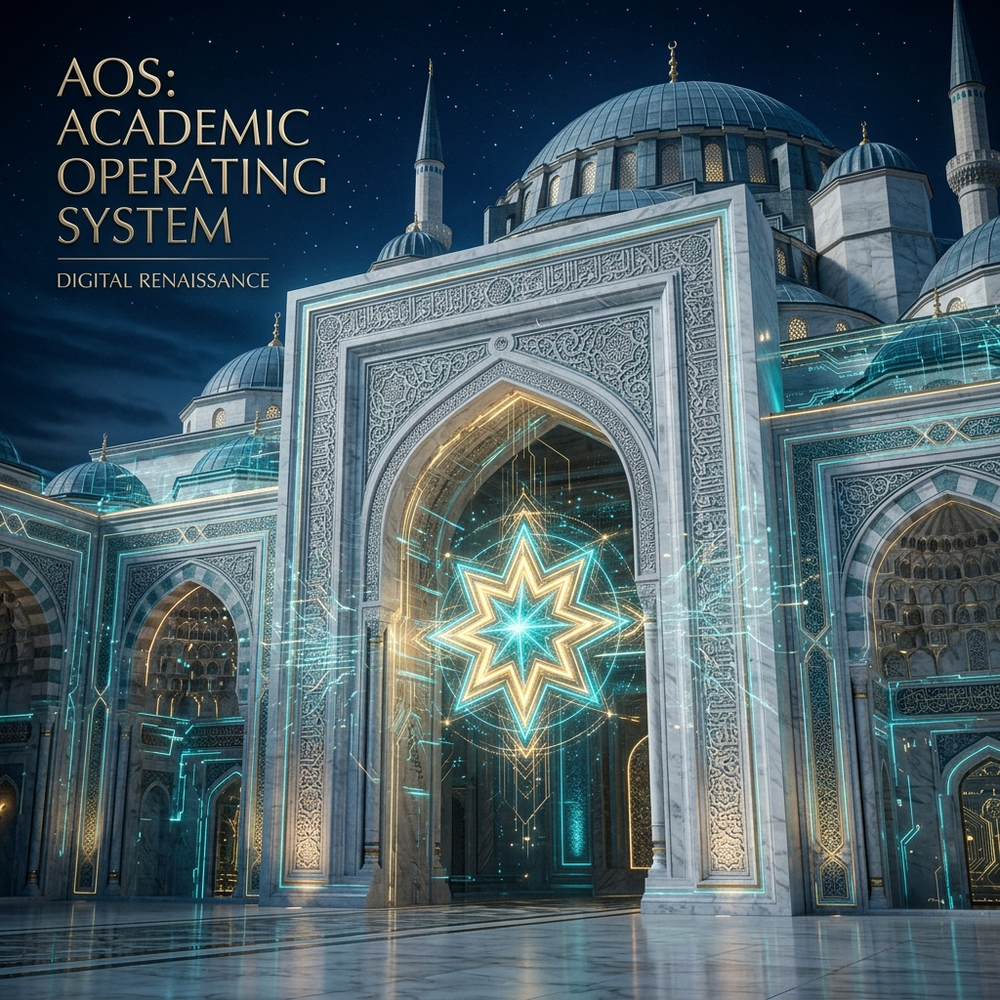

# 🏛️ AKADEMİK İŞLETİM SİSTEMİ (AOS)
### *Yapay Zeka Çağı İçin Evrensel Bilgi Ontolojisi ve Mültidisipliner Zihin Mimarisi* 🌐💎🚀

---

## 📜 AOS MANİFESTOSU: EPİSTEMOLOJİK BÜTÜNLÜK
**Akademik İşletim Sistemi (AOS)**, bilginin ekstrem düzeyde parçalandığı ve dezenformasyonun arttığı Post-AI döneminde, rasyonel zihni korumak ve geliştirmek için tasarlanmış **"Büyük Birleşik Bilgi Çerçevesi"**dir. 

AOS, bilgiyi sadece tüketilen bir meta olarak değil, inşa edilen bir mimari olarak ele alır. Bu ekosistem, disiplinler arasındaki duvarları yıkarak; mühendislik matematiğini, sosyal bilimlerin derinliği ve ahlakın vizyonu ile tek bir potada eritir. AOS, bir disiplinler bütünü değil, bir zihin disiplinidir.

---

## ⚙️ SİSTEMATİK YAPI: 7-KADEMELİ ELİT NİZAM (00-06)
AOS içindeki her branş, rastgele notlar yerine **Systemum Standardı** adı verilen 7 katmanlı rijit bir hiyerarşi üzerine inşa edilmiştir. Bu yapı, Bologna Süreci ve ABET standartlarının ötesine geçerek, bireysel uzmanlığı otonom üretim seviyesine taşır:

> [!NOTE]
> **Hiyerarşik Ontoloji:** Veri -> Enformasyon -> Bilgi -> Hikmet dönüşümünü sağlamak için her alan dikey olarak bu 7 kademeye bölünmüştür.

1. **`00 — Hazırlık & Oryantasyon`**: Terminoloji hakimiyeti, yabancı dil yeterliliği ve metodolojik giriş.
2. **`01 — Teorik Temeller`**: Matematiksel modelleme, fiziksel yasalar ve disiplinin kuramsal omurgası.
3. **`02 — Çekirdek Müfredat`**: Zorunlu ana branş yetkinlikleri ve uygulama pratikleri.
4. **`03 — İleri Uzmanlık`**: Niş alanlarda derinleşme, seçmeli uzmanlık dökümantasyonu.
5. **`04 — AR-GE & Üretim`**: Bitirme projeleri, Capstone çalışmaları ve orijinal akademik çıktılar.
6. **`05 — Akademik Kariyer`**: Lisansüstü araştırma metodolojileri ve bilimsel yayın hazırlığı.
7. **`06 — Portfolyo & Endüstri`**: Küresel sertifikasyonlar, endüstriyel standartlar (ISO, IEEE, MIL-STD) ve profesyonel ağ.

---

## 🕌 FELSEFİ MİRAS VE VİZYONER RUH
AOS, modern bilimsel metodolojiyi rasyonel bir **Yöntem** olarak kullanır. Ancak bu devasa iskelete can veren "Ruh"; kalp ve aklın, fenle dinin imtizacını hedefleyen **Medresetü’z-Zehra** vizyonundan beslenir. Bu vizyon, salt bilgi yığınını bir "Hikmet" (Wisdom) seviyesine taşıma gayretidir.

Bu proje, bilginin sadece maddeden ibaret olmadığını savunan; maddeyi aklın nuruyla, manayı ise vicdanın ziyasıyla aydınlatan kadim bir mirasın dijital izdüşümüdür. Medresetü’z-Zehra, sadece bir eğitim kurumu değil; fen ilimleriyle din ilimlerinin barıştığı, modernitenin köklerle buluştuğu ve insanın "Zülcenahayn" (Çift Kanatlı) bir varlık olarak yeniden inşasını hedefleyen bir ideadır.

AOS mimarisi, bu idea doğrultusunda şu temel direkler üzerine yükselir:
- **Envanter Metodolojisi:** Varlık âleminin her bir hücresini (her bir branş) birer ayet/kanıt olarak görüp dökümante etmek.
- **İmtizac Sırrı:** Mühendisliğin soğuk rasyonalitesini, edebiyatın ve felsefenin sıcak estetiğiyle birleştirerek "Bütüncül İnsan" modelini oluşturmak.
- **Evrensel Nizam:** Mikro-kozmostan makro-kozmosa kadar her alanda var olan o büyük nizamı (Operating System), akademik branşların nizamıyla eşleştirmek.

| ✍️ Temel Düstur | 🏛️ AOS Uygulama Prensibi |
| :--- | :--- |
| **"Eyleme dökülmeyen ilim, yerinde sayan bir gölge gibidir."** | **Otonom Üretim & Aktif Mühendislik** |
| **"Hakikat için Din ve Fen el eledir."** | **Zülcenahayn (Çift Kanatlı) Entegrasyon** |
| **"Varlığın büyük nizamını bilmek için çabala."** | **Ampirik Sorgulama & Rasyonel Titizlik** |

---

## 🛠️ MODERN ENSTRÜMANTASYON (TEKNOLOJİ YIĞINI)
AOS, 21. yüzyılın en ileri araçlarıyla donatılmış bir "Dijital Medrese"dir:
- **Çekirdek Zeka:** Gemini 2.0 & Claude 3.5 Sonnet (Bilgi Sentezleyici)
- **Geliştirme Ortamı:** Cursor / Windsurf (Agentic Coding & Otomasyon)
- **Araştırma Motoru:** Perplexity Pro (Gerçek Zamanlı Akademik Arama)
- **Bilgi Yönetimi:** Obsidian & Markdown Hiyerarşisi (Epistemolojik Graft)

---

## 🎯 KULLANIM REHBERİ: AOS NASIL ÇALIŞIR?
AOS bir depodan (Repository) ziyade, bir yaşam tarzı ve kariyer yönetim mekanizmasıdır:
1. **Navigasyon:** SUMMARY.md üzerinden ilgilenen alanı seçin.
2. **Standardizasyon:** Her alandaki 00-06 yapısını takip edin.
3. **Üretim:** Öğrendiğiniz her bilgiyi 04 katmanında somut bir projeye dönüştürün.
4. **Sinerji:** Farklı konteynerlar (Örn: Mühendislik ve Felsefe) arasındaki bağları `cross-references` ile kurun.

---

## 📚 ANSİKLOPEDİK BÖLÜM DİZİNİ (372 BRANŞ)

Aşağıdaki kategoriler, AOS ekosisteminin 372 benzersiz hücresini temsil eder.

<b>🛠️ Mühendislik & İleri Teknoloji (64 Alan)</b>

 

| Branş / Alan | Akademik Misyon & Stratejik Odak |
| :--- | :--- |
| [Adli Bilişim Mühendisliği](meta_muhendislik/adli_bilisim_muhendisligi/) | Sistem tasarımı ve ampirik çözümleme odaklı ileri mühendislik alanı. |
| [Akilli Gorsel Isitsel Muhendislik](meta_muhendislik/akilli_gorsel_isitsel_muhendislik/) | Sistem tasarımı ve ampirik çözümleme odaklı ileri mühendislik alanı. |
| [Akilli Molekuler Muhendislik](meta_muhendislik/akilli_molekuler_muhendislik/) | Sistem tasarımı ve ampirik çözümleme odaklı ileri mühendislik alanı. |
| [Akilli Sebeke Bilgi Ve Mühendisliği](meta_muhendislik/akilli_sebeke_bilgi_ve_muhendisligi/) | Sistem tasarımı ve ampirik çözümleme odaklı ileri mühendislik alanı. |
| [Ambalaj Mühendisliği](meta_muhendislik/ambalaj_muhendisligi/) | Sistem tasarımı ve ampirik çözümleme odaklı ileri mühendislik alanı. |
| [Basim Teknolojileri](meta_muhendislik/basim_teknolojileri/) | Basim Teknolojileri disiplinine ait teorik ve pratik uzmanlık deposu. |
| [Beyin Bilgisayar Arayuzu Bci Mühendisliği](meta_muhendislik/beyin_bilgisayar_arayuzu_bci_muhendisligi/) | Sistem tasarımı ve ampirik çözümleme odaklı ileri mühendislik alanı. |
| [Bilgisayar Mühendisliği](meta_muhendislik/bilgisayar_muhendisligi/) | Sistem tasarımı ve ampirik çözümleme odaklı ileri mühendislik alanı. |
| [Bilişim Sistemleri Mühendisliği](meta_muhendislik/bilisim_sistemleri_muhendisligi/) | Sistem tasarımı ve ampirik çözümleme odaklı ileri mühendislik alanı. |
| [Biyokimya Mühendisliği](meta_muhendislik/biyokimya_muhendisligi/) | Sistem tasarımı ve ampirik çözümleme odaklı ileri mühendislik alanı. |
| [Biyomedikal Mühendisliği](meta_muhendislik/biyomedikal_muhendisligi/) | Sistem tasarımı ve ampirik çözümleme odaklı ileri mühendislik alanı. |
| [Biyosistem Mühendisliği](meta_muhendislik/biyosistem_muhendisligi/) | Sistem tasarımı ve ampirik çözümleme odaklı ileri mühendislik alanı. |
| [Cevher Hazirlama Mühendisliği](meta_muhendislik/cevher_hazirlama_muhendisligi/) | Sistem tasarımı ve ampirik çözümleme odaklı ileri mühendislik alanı. |
| [Cevre Mühendisliği](meta_muhendislik/cevre_muhendisligi/) | Sistem tasarımı ve ampirik çözümleme odaklı ileri mühendislik alanı. |
| [Deniz Ulastirma İşletme Mühendisliği](meta_muhendislik/deniz_ulastirma_isletme_muhendisligi/) | Sistem tasarımı ve ampirik çözümleme odaklı ileri mühendislik alanı. |
| [Deri Mühendisliği](meta_muhendislik/deri_muhendisligi/) | Sistem tasarımı ve ampirik çözümleme odaklı ileri mühendislik alanı. |
| [Dusuk Irtifa Teknolojisi Ve Iha](meta_muhendislik/dusuk_irtifa_teknolojisi_ve_iha/) | Dusuk Irtifa Teknolojisi Ve Iha disiplinine ait teorik ve pratik uzmanlık deposu. |
| [Elektrik Elektronik Mühendisliği](meta_muhendislik/elektrik_elektronik_muhendisligi/) | Enerji, sinyal ve sistem teorisinin modern mühendislik zirvesi. |
| [Elektronik Ve Haberlesme Mühendisliği](meta_muhendislik/elektronik_ve_haberlesme_muhendisligi/) | Sistem tasarımı ve ampirik çözümleme odaklı ileri mühendislik alanı. |
| [Endustri Mühendisliği](meta_muhendislik/endustri_muhendisligi/) | Sistem tasarımı ve ampirik çözümleme odaklı ileri mühendislik alanı. |
| [Endustriyel Tasarim Mühendisliği](meta_muhendislik/endustriyel_tasarim_muhendisligi/) | Sistem tasarımı ve ampirik çözümleme odaklı ileri mühendislik alanı. |
| [Enerji Sistemleri Mühendisliği](meta_muhendislik/enerji_sistemleri_muhendisligi/) | Sistem tasarımı ve ampirik çözümleme odaklı ileri mühendislik alanı. |
| [Finans Mühendisliği](meta_muhendislik/finans_muhendisligi/) | Sistem tasarımı ve ampirik çözümleme odaklı ileri mühendislik alanı. |
| [Fizik Mühendisliği](meta_muhendislik/fizik_muhendisligi/) | Sistem tasarımı ve ampirik çözümleme odaklı ileri mühendislik alanı. |
| [Gemi İnşaati Ve Gemi Makineleri Mühendisliği](meta_muhendislik/gemi_insaati_ve_gemi_makineleri_muhendisligi/) | Sistem tasarımı ve ampirik çözümleme odaklı ileri mühendislik alanı. |
| [Gemi Makineleri İşletme Mühendisliği](meta_muhendislik/gemi_makineleri_isletme_muhendisligi/) | Sistem tasarımı ve ampirik çözümleme odaklı ileri mühendislik alanı. |
| [Geomatik Mühendisliği](meta_muhendislik/geomatik_muhendisligi/) | Sistem tasarımı ve ampirik çözümleme odaklı ileri mühendislik alanı. |
| [Gida Mühendisliği](meta_muhendislik/gida_muhendisligi/) | Sistem tasarımı ve ampirik çözümleme odaklı ileri mühendislik alanı. |
| [Harita Mühendisliği](meta_muhendislik/harita_muhendisligi/) | Sistem tasarımı ve ampirik çözümleme odaklı ileri mühendislik alanı. |
| [Havacilik Ve Uzay Mühendisliği](meta_muhendislik/havacilik_ve_uzay_muhendisligi/) | Yeryüzü sınırlarını aşan yüksek fizik ve itki mühendisliği. |
| [Imalat Mühendisliği](meta_muhendislik/imalat_muhendisligi/) | Sistem tasarımı ve ampirik çözümleme odaklı ileri mühendislik alanı. |
| [İnşaat Mühendisliği](meta_muhendislik/insaat_muhendisligi/) | Sistem tasarımı ve ampirik çözümleme odaklı ileri mühendislik alanı. |
| [Ipek Mühendisliği Ve Serikultur](meta_muhendislik/ipek_muhendisligi_ve_serikultur/) | Sistem tasarımı ve ampirik çözümleme odaklı ileri mühendislik alanı. |
| [İşletme Mühendisliği](meta_muhendislik/isletme_muhendisligi/) | Sistem tasarımı ve ampirik çözümleme odaklı ileri mühendislik alanı. |
| [Jeofizik Mühendisliği](meta_muhendislik/jeofizik_muhendisligi/) | Sistem tasarımı ve ampirik çözümleme odaklı ileri mühendislik alanı. |
| [Jeoloji Mühendisliği](meta_muhendislik/jeoloji_muhendisligi/) | Sistem tasarımı ve ampirik çözümleme odaklı ileri mühendislik alanı. |
| [Kagit Bilimi Ve Mühendisliği](meta_muhendislik/kagit_bilimi_ve_muhendisligi/) | Sistem tasarımı ve ampirik çözümleme odaklı ileri mühendislik alanı. |
| [Karbon Notr Bilimi Ve Teknolojisi](meta_muhendislik/karbon_notr_bilimi_ve_teknolojisi/) | Karbon Notr Bilimi Ve Teknolojisi disiplinine ait teorik ve pratik uzmanlık deposu. |
| [Kimya Mühendisliği](meta_muhendislik/kimya_muhendisligi/) | Sistem tasarımı ve ampirik çözümleme odaklı ileri mühendislik alanı. |
| [Kontrol Ve Otomasyon Mühendisliği](meta_muhendislik/kontrol_ve_otomasyon_muhendisligi/) | Sistem tasarımı ve ampirik çözümleme odaklı ileri mühendislik alanı. |
| [Maden Mühendisliği](meta_muhendislik/maden_muhendisligi/) | Sistem tasarımı ve ampirik çözümleme odaklı ileri mühendislik alanı. |
| [Makine Mühendisliği](meta_muhendislik/makine_muhendisligi/) | Sistem tasarımı ve ampirik çözümleme odaklı ileri mühendislik alanı. |
| [Matematik Mühendisliği](meta_muhendislik/matematik_muhendisligi/) | Sistem tasarımı ve ampirik çözümleme odaklı ileri mühendislik alanı. |
| [Mekatronik Mühendisliği](meta_muhendislik/mekatronik_muhendisligi/) | Sistem tasarımı ve ampirik çözümleme odaklı ileri mühendislik alanı. |
| [Metalurji Ve Malzeme Mühendisliği](meta_muhendislik/metalurji_ve_malzeme_muhendisligi/) | Sistem tasarımı ve ampirik çözümleme odaklı ileri mühendislik alanı. |
| [Mikro Nano Sistemler Ve Mems](meta_muhendislik/mikro_nano_sistemler_ve_mems/) | Mikro Nano Sistemler Ve Mems disiplinine ait teorik ve pratik uzmanlık deposu. |
| [Modelleme Ve Simulasyon](meta_muhendislik/modelleme_ve_simulasyon/) | Modelleme Ve Simulasyon disiplinine ait teorik ve pratik uzmanlık deposu. |
| [Nanoteknoloji Mühendisliği](meta_muhendislik/nanoteknoloji_muhendisligi/) | Sistem tasarımı ve ampirik çözümleme odaklı ileri mühendislik alanı. |
| [Nukleer Enerji Mühendisliği](meta_muhendislik/nukleer_enerji_muhendisligi/) | Sistem tasarımı ve ampirik çözümleme odaklı ileri mühendislik alanı. |
| [Orman Mühendisliği](meta_muhendislik/orman_muhendisligi/) | Sistem tasarımı ve ampirik çözümleme odaklı ileri mühendislik alanı. |
| [Otomotiv Mühendisliği](meta_muhendislik/otomotiv_muhendisligi/) | Sistem tasarımı ve ampirik çözümleme odaklı ileri mühendislik alanı. |
| [Rayli Sistemler Mühendisliği](meta_muhendislik/rayli_sistemler_muhendisligi/) | Sistem tasarımı ve ampirik çözümleme odaklı ileri mühendislik alanı. |
| [Seramik Tasarimi Ve Mühendisliği](meta_muhendislik/seramik_tasarimi_ve_muhendisligi/) | Sistem tasarımı ve ampirik çözümleme odaklı ileri mühendislik alanı. |
| [Siber Guvenlik Mühendisliği](meta_muhendislik/siber_guvenlik_muhendisligi/) | Dijital kalelerin savunma ve strateji merkezi. |
| [Su Urunleri Mühendisliği](meta_muhendislik/su_urunleri_muhendisligi/) | Sistem tasarımı ve ampirik çözümleme odaklı ileri mühendislik alanı. |
| [Tarim Makineleri Ve Teknolojileri Mühendisliği](meta_muhendislik/tarim_makineleri_ve_teknolojileri_muhendisligi/) | Sistem tasarımı ve ampirik çözümleme odaklı ileri mühendislik alanı. |
| [Tekstil Mühendisliği](meta_muhendislik/tekstil_muhendisligi/) | Sistem tasarımı ve ampirik çözümleme odaklı ileri mühendislik alanı. |
| [Ucak Mühendisliği](meta_muhendislik/ucak_muhendisligi/) | Sistem tasarımı ve ampirik çözümleme odaklı ileri mühendislik alanı. |
| [Ulaşım Mühendisliği](meta_muhendislik/ulasim_muhendisligi/) | Sistem tasarımı ve ampirik çözümleme odaklı ileri mühendislik alanı. |
| [Uzay Zaman Bilgi Mühendisliği](meta_muhendislik/uzay_zaman_bilgi_muhendisligi/) | Sistem tasarımı ve ampirik çözümleme odaklı ileri mühendislik alanı. |
| [Yapay Zeka Ve Veri Mühendisliği](meta_muhendislik/yapay_zeka_ve_veri_muhendisligi/) | Veriden anlam çıkaran otonom sistemlerin mimarisi. |
| [Yazilim Mühendisliği](meta_muhendislik/yazilim_muhendisligi/) | Sistem tasarımı ve ampirik çözümleme odaklı ileri mühendislik alanı. |
| [Yuksek Guclu Yariiletken Bilimi Ve Mühendisliği](meta_muhendislik/yuksek_guclu_yariiletken_bilimi_ve_muhendisligi/) | Sistem tasarımı ve ampirik çözümleme odaklı ileri mühendislik alanı. |
| [Ziraat Mühendisliği](meta_muhendislik/ziraat_muhendisligi/) | Sistem tasarımı ve ampirik çözümleme odaklı ileri mühendislik alanı. |

<b>🏛️ Mimarlık, Tasarım & Şehircilik (15 Alan)</b>

 

| Branş / Alan | Akademik Misyon & Stratejik Odak |
| :--- | :--- |
| [Cizgi Film Ve Animasyon](mimarlik_ve_tasarim/cizgi_film_ve_animasyon/) | Cizgi Film Ve Animasyon disiplinine ait teorik ve pratik uzmanlık deposu. |
| [Endustriyel Tasarim](mimarlik_ve_tasarim/endustriyel_tasarim/) | Endustriyel Tasarim disiplinine ait teorik ve pratik uzmanlık deposu. |
| [Gorsel Iletisim Tasarimi](mimarlik_ve_tasarim/gorsel_iletisim_tasarimi/) | Gorsel Iletisim Tasarimi disiplinine ait teorik ve pratik uzmanlık deposu. |
| [Grafik Tasarimi](mimarlik_ve_tasarim/grafik_tasarimi/) | Grafik Tasarimi disiplinine ait teorik ve pratik uzmanlık deposu. |
| [Ic Mimarlik Ve Cevre Tasarimi](mimarlik_ve_tasarim/ic_mimarlik_ve_cevre_tasarimi/) | Ic Mimarlik Ve Cevre Tasarimi disiplinine ait teorik ve pratik uzmanlık deposu. |
| [Kultur Varliklarini Koruma Ve Onarim](mimarlik_ve_tasarim/kultur_varliklarini_koruma_ve_onarim/) | Kultur Varliklarini Koruma Ve Onarim disiplinine ait teorik ve pratik uzmanlık deposu. |
| [Kuyumculuk Ve Mucevher Tasarimi](mimarlik_ve_tasarim/kuyumculuk_ve_mucevher_tasarimi/) | Kuyumculuk Ve Mucevher Tasarimi disiplinine ait teorik ve pratik uzmanlık deposu. |
| [Mimarlik](mimarlik_ve_tasarim/mimarlik/) | Mimarlik disiplinine ait teorik ve pratik uzmanlık deposu. |
| [Mucevherat Ve Degerli Tas Bilimi](mimarlik_ve_tasarim/mucevherat_ve_degerli_tas_bilimi/) | Mucevherat Ve Degerli Tas Bilimi disiplinine ait teorik ve pratik uzmanlık deposu. |
| [Muzik](mimarlik_ve_tasarim/muzik/) | Muzik disiplinine ait teorik ve pratik uzmanlık deposu. |
| [Peyzaj Mimarligi](mimarlik_ve_tasarim/peyzaj_mimarligi/) | Peyzaj Mimarligi disiplinine ait teorik ve pratik uzmanlık deposu. |
| [Sehir Ve Bolge Planlama](mimarlik_ve_tasarim/sehir_ve_bolge_planlama/) | Sehir Ve Bolge Planlama disiplinine ait teorik ve pratik uzmanlık deposu. |
| [Seramik Ve Cam Tasarimi](mimarlik_ve_tasarim/seramik_ve_cam_tasarimi/) | Seramik Ve Cam Tasarimi disiplinine ait teorik ve pratik uzmanlık deposu. |
| [Tekstil Ve Moda Tasarimi](mimarlik_ve_tasarim/tekstil_ve_moda_tasarimi/) | Tekstil Ve Moda Tasarimi disiplinine ait teorik ve pratik uzmanlık deposu. |
| [Tiyatro Oyunculuk](mimarlik_ve_tasarim/tiyatro_oyunculuk/) | Tiyatro Oyunculuk disiplinine ait teorik ve pratik uzmanlık deposu. |

<b>🖼️ Güzel Sanatlar & Estetik (8 Alan)</b>

 

| Branş / Alan | Akademik Misyon & Stratejik Odak |
| :--- | :--- |
| [Dijital Tiyatro](guzel_sanatlar/dijital_tiyatro/) | Dijital Tiyatro disiplinine ait teorik ve pratik uzmanlık deposu. |
| [El Sanatlari](guzel_sanatlar/el_sanatlari/) | El Sanatlari disiplinine ait teorik ve pratik uzmanlık deposu. |
| [Fotograf](guzel_sanatlar/fotograf/) | Fotograf disiplinine ait teorik ve pratik uzmanlık deposu. |
| [Geleneksel Cin Operasi Ve Muzigi](guzel_sanatlar/geleneksel_cin_operasi_ve_muzigi/) | Geleneksel Cin Operasi Ve Muzigi disiplinine ait teorik ve pratik uzmanlık deposu. |
| [Geleneksel Turk Sanatlari](guzel_sanatlar/geleneksel_turk_sanatlari/) | Geleneksel Turk Sanatlari disiplinine ait teorik ve pratik uzmanlık deposu. |
| [Guzel Sanatlar Arastirma](guzel_sanatlar/guzel_sanatlar_arastirma/) | Guzel Sanatlar Arastirma disiplinine ait teorik ve pratik uzmanlık deposu. |
| [Heykel](guzel_sanatlar/heykel/) | Heykel disiplinine ait teorik ve pratik uzmanlık deposu. |
| [Resim](guzel_sanatlar/resim/) | Resim disiplinine ait teorik ve pratik uzmanlık deposu. |

<b>🩺 Sağlık Bilimleri & Tıp (30 Alan)</b>

 

| Branş / Alan | Akademik Misyon & Stratejik Odak |
| :--- | :--- |
| [Acil Yardim Ve Afet Yonetimi](saglik/acil_yardim_ve_afet_yonetimi/) | Operasyonel ve stratejik karar destek mekanizmalarının yönetimi. |
| [Akupunktur Ve Moxibustion](saglik/akupunktur_ve_moxibustion/) | Akupunktur Ve Moxibustion disiplinine ait teorik ve pratik uzmanlık deposu. |
| [Ameliyathane Hizmetleri](saglik/ameliyathane_hizmetleri/) | Ameliyathane Hizmetleri disiplinine ait teorik ve pratik uzmanlık deposu. |
| [Anestezi Ve Reanimasyon](saglik/anestezi_ve_reanimasyon/) | Anestezi Ve Reanimasyon disiplinine ait teorik ve pratik uzmanlık deposu. |
| [Beslenme Ve Diyetetik](saglik/beslenme_ve_diyetetik/) | Beslenme Ve Diyetetik disiplinine ait teorik ve pratik uzmanlık deposu. |
| [Cocuk Gelisimi](saglik/cocuk_gelisimi/) | Cocuk Gelisimi disiplinine ait teorik ve pratik uzmanlık deposu. |
| [Dil Ve Konusma Terapisi](saglik/dil_ve_konusma_terapisi/) | Dil Ve Konusma Terapisi disiplinine ait teorik ve pratik uzmanlık deposu. |
| [Dis Hekimligi](saglik/dis_hekimligi/) | Dis Hekimligi disiplinine ait teorik ve pratik uzmanlık deposu. |
| [Ebelik](saglik/ebelik/) | Ebelik disiplinine ait teorik ve pratik uzmanlık deposu. |
| [Eczacilik](saglik/eczacilik/) | Eczacilik disiplinine ait teorik ve pratik uzmanlık deposu. |
| [Ergoterapi](saglik/ergoterapi/) | Ergoterapi disiplinine ait teorik ve pratik uzmanlık deposu. |
| [Fizyoterapi Ve Rehabilitasyon](saglik/fizyoterapi_ve_rehabilitasyon/) | Fizyoterapi Ve Rehabilitasyon disiplinine ait teorik ve pratik uzmanlık deposu. |
| [Geleneksel Cin Tibbi](saglik/geleneksel_cin_tibbi/) | Geleneksel Cin Tibbi disiplinine ait teorik ve pratik uzmanlık deposu. |
| [Geleneksel Cin Veteriner Hekimligi](saglik/geleneksel_cin_veteriner_hekimligi/) | Geleneksel Cin Veteriner Hekimligi disiplinine ait teorik ve pratik uzmanlık deposu. |
| [Gerontoloji](saglik/gerontoloji/) | Gerontoloji disiplinine ait teorik ve pratik uzmanlık deposu. |
| [Hemsirelik](saglik/hemsirelik/) | Hemsirelik disiplinine ait teorik ve pratik uzmanlık deposu. |
| [Is Ve Ugrasi Terapisi](saglik/is_ve_ugrasi_terapisi/) | Is Ve Ugrasi Terapisi disiplinine ait teorik ve pratik uzmanlık deposu. |
| [Medikal Cihaz Ve Ekipman Mühendisliği](saglik/medikal_cihaz_ve_ekipman_muhendisligi/) | Sistem tasarımı ve ampirik çözümleme odaklı ileri mühendislik alanı. |
| [Molekuler Biyoloji Ve Genetik](saglik/molekuler_biyoloji_ve_genetik/) | Molekuler Biyoloji Ve Genetik disiplinine ait teorik ve pratik uzmanlık deposu. |
| [Nukleer Eczacilik](saglik/nukleer_eczacilik/) | Nukleer Eczacilik disiplinine ait teorik ve pratik uzmanlık deposu. |
| [Odyoloji](saglik/odyoloji/) | Odyoloji disiplinine ait teorik ve pratik uzmanlık deposu. |
| [Ozurluluk Calismalari](saglik/ozurluluk_calismalari/) | Ozurluluk Calismalari disiplinine ait teorik ve pratik uzmanlık deposu. |
| [Perfuzyon](saglik/perfuzyon/) | Perfuzyon disiplinine ait teorik ve pratik uzmanlık deposu. |
| [Saglik Bilimi Ve Teknolojisi](saglik/saglik_bilimi_ve_teknolojisi/) | Saglik Bilimi Ve Teknolojisi disiplinine ait teorik ve pratik uzmanlık deposu. |
| [Saglik Ve Tibbi Guvenlik](saglik/saglik_ve_tibbi_guvenlik/) | Saglik Ve Tibbi Guvenlik disiplinine ait teorik ve pratik uzmanlık deposu. |
| [Saglik Yonetimi](saglik/saglik_yonetimi/) | Operasyonel ve stratejik karar destek mekanizmalarının yönetimi. |
| [Tibbi Goruntuleme Teknikleri](saglik/tibbi_goruntuleme_teknikleri/) | Tibbi Goruntuleme Teknikleri disiplinine ait teorik ve pratik uzmanlık deposu. |
| [Tibbi Laboratuvar Teknikleri](saglik/tibbi_laboratuvar_teknikleri/) | Tibbi Laboratuvar Teknikleri disiplinine ait teorik ve pratik uzmanlık deposu. |
| [Tip](saglik/tip/) | Tip disiplinine ait teorik ve pratik uzmanlık deposu. |
| [Veterinerlik](saglik/veterinerlik/) | Veterinerlik disiplinine ait teorik ve pratik uzmanlık deposu. |

<b>🎓 Eğitim Fakültesi & Pedagoji (16 Alan)</b>

 

| Branş / Alan | Akademik Misyon & Stratejik Odak |
| :--- | :--- |
| [Beden Egitimi Ve Spor Ogretmenligi](ogretmenlik/beden_egitimi_ve_spor_ogretmenligi/) | Beden Egitimi Ve Spor Ogretmenligi disiplinine ait teorik ve pratik uzmanlık deposu. |
| [Bilgisayar Ve Ogretim Teknolojileri Egitimi](ogretmenlik/bilgisayar_ve_ogretim_teknolojileri_egitimi/) | Bilgisayar Ve Ogretim Teknolojileri Egitimi disiplinine ait teorik ve pratik uzmanlık deposu. |
| [Din Kulturu Ve Ahlak Bilgisi Ogretmenligi](ogretmenlik/din_kulturu_ve_ahlak_bilgisi_ogretmenligi/) | Din Kulturu Ve Ahlak Bilgisi Ogretmenligi disiplinine ait teorik ve pratik uzmanlık deposu. |
| [Egitim Yonetimi](ogretmenlik/egitim_yonetimi/) | Operasyonel ve stratejik karar destek mekanizmalarının yönetimi. |
| [Fen Bilgisi Ogretmenligi](ogretmenlik/fen_bilgisi_ogretmenligi/) | Fen Bilgisi Ogretmenligi disiplinine ait teorik ve pratik uzmanlık deposu. |
| [Ilkogretim Matematik Ogretmenligi](ogretmenlik/ilkogretim_matematik_ogretmenligi/) | Ilkogretim Matematik Ogretmenligi disiplinine ait teorik ve pratik uzmanlık deposu. |
| [Ingilizce Ogretmenligi](ogretmenlik/ingilizce_ogretmenligi/) | Ingilizce Ogretmenligi disiplinine ait teorik ve pratik uzmanlık deposu. |
| [Muzik Ogretmenligi](ogretmenlik/muzik_ogretmenligi/) | Muzik Ogretmenligi disiplinine ait teorik ve pratik uzmanlık deposu. |
| [Okul Oncesi Ogretmenligi](ogretmenlik/okul_oncesi_ogretmenligi/) | Okul Oncesi Ogretmenligi disiplinine ait teorik ve pratik uzmanlık deposu. |
| [Ozel Egitim Ogretmenligi](ogretmenlik/ozel_egitim_ogretmenligi/) | Ozel Egitim Ogretmenligi disiplinine ait teorik ve pratik uzmanlık deposu. |
| [Rehberlik Ve Psikolojik Danismanlik](ogretmenlik/rehberlik_ve_psikolojik_danismanlik/) | Rehberlik Ve Psikolojik Danismanlik disiplinine ait teorik ve pratik uzmanlık deposu. |
| [Resim Is Ogretmenligi](ogretmenlik/resim_is_ogretmenligi/) | Resim Is Ogretmenligi disiplinine ait teorik ve pratik uzmanlık deposu. |
| [Saglik Bilgisi Ogretmenligi](ogretmenlik/saglik_bilgisi_ogretmenligi/) | Saglik Bilgisi Ogretmenligi disiplinine ait teorik ve pratik uzmanlık deposu. |
| [Sinif Ogretmenligi](ogretmenlik/sinif_ogretmenligi/) | Sinif Ogretmenligi disiplinine ait teorik ve pratik uzmanlık deposu. |
| [Sosyal Bilgiler Ogretmenligi](ogretmenlik/sosyal_bilgiler_ogretmenligi/) | Sosyal Bilgiler Ogretmenligi disiplinine ait teorik ve pratik uzmanlık deposu. |
| [Turkce Ogretmenligi](ogretmenlik/turkce_ogretmenligi/) | Turkce Ogretmenligi disiplinine ait teorik ve pratik uzmanlık deposu. |

<b>🏅 Spor Bilimleri & Performans (8 Alan)</b>

 

| Branş / Alan | Akademik Misyon & Stratejik Odak |
| :--- | :--- |
| [Antrenorluk Egitimi](spor_bilimleri/antrenorluk_egitimi/) | Antrenorluk Egitimi disiplinine ait teorik ve pratik uzmanlık deposu. |
| [Beden Egitimi Ve Spor Bilimleri](spor_bilimleri/beden_egitimi_ve_spor_bilimleri/) | Beden Egitimi Ve Spor Bilimleri disiplinine ait teorik ve pratik uzmanlık deposu. |
| [Buz Ve Kar Dansi Performansi](spor_bilimleri/buz_ve_kar_dansi_performansi/) | Buz Ve Kar Dansi Performansi disiplinine ait teorik ve pratik uzmanlık deposu. |
| [Futbol Bilimi](spor_bilimleri/futbol_bilimi/) | Futbol Bilimi disiplinine ait teorik ve pratik uzmanlık deposu. |
| [Geleneksel Cin Savas Sanatlari Wushu](spor_bilimleri/geleneksel_cin_savas_sanatlari_wushu/) | Geleneksel Cin Savas Sanatlari Wushu disiplinine ait teorik ve pratik uzmanlık deposu. |
| [Havacilik Sporlari](spor_bilimleri/havacilik_sporlari/) | Havacilik Sporlari disiplinine ait teorik ve pratik uzmanlık deposu. |
| [Rekreasyon](spor_bilimleri/rekreasyon/) | Rekreasyon disiplinine ait teorik ve pratik uzmanlık deposu. |
| [Spor Yoneticiligi](spor_bilimleri/spor_yoneticiligi/) | Spor Yoneticiligi disiplinine ait teorik ve pratik uzmanlık deposu. |

<b>⚖️ Sosyal, Beşeri & İdari Bilimler (39 Alan)</b>

 

| Branş / Alan | Akademik Misyon & Stratejik Odak |
| :--- | :--- |
| [Aktüerya Bilimleri](sosyal_ve_beseri_bilimler/aktüerya_bilimleri/) | Aktüerya Bilimleri disiplinine ait teorik ve pratik uzmanlık deposu. |
| [Antropoloji](sosyal_ve_beseri_bilimler/antropoloji/) | Antropoloji disiplinine ait teorik ve pratik uzmanlık deposu. |
| [Arkeoloji](sosyal_ve_beseri_bilimler/arkeoloji/) | Arkeoloji disiplinine ait teorik ve pratik uzmanlık deposu. |
| [Bolgesel Ve Ulke Arastirmalari](sosyal_ve_beseri_bilimler/bolgesel_ve_ulke_arastirmalari/) | Bolgesel Ve Ulke Arastirmalari disiplinine ait teorik ve pratik uzmanlık deposu. |
| [Calisma Ekonomisi Ve Endustri Iliskileri](sosyal_ve_beseri_bilimler/calisma_ekonomisi_ve_endustri_iliskileri/) | Calisma Ekonomisi Ve Endustri Iliskileri disiplinine ait teorik ve pratik uzmanlık deposu. |
| [Cografya](sosyal_ve_beseri_bilimler/cografya/) | Cografya disiplinine ait teorik ve pratik uzmanlık deposu. |
| [Dilbilim](sosyal_ve_beseri_bilimler/dilbilim/) | Dilbilim disiplinine ait teorik ve pratik uzmanlık deposu. |
| [Dis Ticaret](sosyal_ve_beseri_bilimler/dis_ticaret/) | Dis Ticaret disiplinine ait teorik ve pratik uzmanlık deposu. |
| [Ekonometri](sosyal_ve_beseri_bilimler/ekonometri/) | Ekonometri disiplinine ait teorik ve pratik uzmanlık deposu. |
| [Ekonomi](sosyal_ve_beseri_bilimler/ekonomi/) | Ekonomi disiplinine ait teorik ve pratik uzmanlık deposu. |
| [Enerji Yonetimi](sosyal_ve_beseri_bilimler/enerji_yonetimi/) | Operasyonel ve stratejik karar destek mekanizmalarının yönetimi. |
| [Felsefe](sosyal_ve_beseri_bilimler/felsefe/) | Felsefe disiplinine ait teorik ve pratik uzmanlık deposu. |
| [Girisimcilik](sosyal_ve_beseri_bilimler/girisimcilik/) | Girisimcilik disiplinine ait teorik ve pratik uzmanlık deposu. |
| [Halk Bilimi](sosyal_ve_beseri_bilimler/halk_bilimi/) | Halk Bilimi disiplinine ait teorik ve pratik uzmanlık deposu. |
| [Halkbilimi](sosyal_ve_beseri_bilimler/halkbilimi/) | Halkbilimi disiplinine ait teorik ve pratik uzmanlık deposu. |
| [Havacilik Yonetimi](sosyal_ve_beseri_bilimler/havacilik_yonetimi/) | Operasyonel ve stratejik karar destek mekanizmalarının yönetimi. |
| [Iktisat](sosyal_ve_beseri_bilimler/iktisat/) | Iktisat disiplinine ait teorik ve pratik uzmanlık deposu. |
| [Insan Kaynaklari Yonetimi](sosyal_ve_beseri_bilimler/insan_kaynaklari_yonetimi/) | Operasyonel ve stratejik karar destek mekanizmalarının yönetimi. |
| [İşletme](sosyal_ve_beseri_bilimler/isletme/) | Isletme disiplinine ait teorik ve pratik uzmanlık deposu. |
| [Kutuphanecilik Ve Bilgi Yonetimi](sosyal_ve_beseri_bilimler/kutuphanecilik_ve_bilgi_yonetimi/) | Operasyonel ve stratejik karar destek mekanizmalarının yönetimi. |
| [Lojistik Yonetimi](sosyal_ve_beseri_bilimler/lojistik_yonetimi/) | Operasyonel ve stratejik karar destek mekanizmalarının yönetimi. |
| [Maliye](sosyal_ve_beseri_bilimler/maliye/) | Maliye disiplinine ait teorik ve pratik uzmanlık deposu. |
| [Muhasebe Ve Finans Yonetimi](sosyal_ve_beseri_bilimler/muhasebe_ve_finans_yonetimi/) | Operasyonel ve stratejik karar destek mekanizmalarının yönetimi. |
| [Muze Yonetimi](sosyal_ve_beseri_bilimler/muze_yonetimi/) | Operasyonel ve stratejik karar destek mekanizmalarının yönetimi. |
| [Muzeoloji Ve Arsivcilik](sosyal_ve_beseri_bilimler/muzeoloji_ve_arsivcilik/) | Muzeoloji Ve Arsivcilik disiplinine ait teorik ve pratik uzmanlık deposu. |
| [Psikoloji](sosyal_ve_beseri_bilimler/psikoloji/) | Psikoloji disiplinine ait teorik ve pratik uzmanlık deposu. |
| [Sanat Tarihi](sosyal_ve_beseri_bilimler/sanat_tarihi/) | Sanat Tarihi disiplinine ait teorik ve pratik uzmanlık deposu. |
| [Sanat Yonetimi](sosyal_ve_beseri_bilimler/sanat_yonetimi/) | Operasyonel ve stratejik karar destek mekanizmalarının yönetimi. |
| [Sigortacilik Ve Risk Yonetimi](sosyal_ve_beseri_bilimler/sigortacilik_ve_risk_yonetimi/) | Operasyonel ve stratejik karar destek mekanizmalarının yönetimi. |
| [Siyaset Bilimi Ve Kamu Yonetimi](sosyal_ve_beseri_bilimler/siyaset_bilimi_ve_kamu_yonetimi/) | Operasyonel ve stratejik karar destek mekanizmalarının yönetimi. |
| [Sosyal Hizmet](sosyal_ve_beseri_bilimler/sosyal_hizmet/) | Sosyal Hizmet disiplinine ait teorik ve pratik uzmanlık deposu. |
| [Sosyoloji](sosyal_ve_beseri_bilimler/sosyoloji/) | Sosyoloji disiplinine ait teorik ve pratik uzmanlık deposu. |
| [Stratejik Hammadde Ekonomisi](sosyal_ve_beseri_bilimler/stratejik_hammadde_ekonomisi/) | Stratejik Hammadde Ekonomisi disiplinine ait teorik ve pratik uzmanlık deposu. |
| [Su Sektoru Ekonomisi Ve Yonetimi](sosyal_ve_beseri_bilimler/su_sektoru_ekonomisi_ve_yonetimi/) | Operasyonel ve stratejik karar destek mekanizmalarının yönetimi. |
| [Tarih](sosyal_ve_beseri_bilimler/tarih/) | Tarih disiplinine ait teorik ve pratik uzmanlık deposu. |
| [Uluslararasi Iliskiler](sosyal_ve_beseri_bilimler/uluslararasi_iliskiler/) | Uluslararasi Iliskiler disiplinine ait teorik ve pratik uzmanlık deposu. |
| [Uluslararasi Ticaret Ve Lojistik](sosyal_ve_beseri_bilimler/uluslararasi_ticaret_ve_lojistik/) | Uluslararasi Ticaret Ve Lojistik disiplinine ait teorik ve pratik uzmanlık deposu. |
| [Yenilik Yonetimi](sosyal_ve_beseri_bilimler/yenilik_yonetimi/) | Operasyonel ve stratejik karar destek mekanizmalarının yönetimi. |
| [Yonetim Bilişim Sistemleri](sosyal_ve_beseri_bilimler/yonetim_bilisim_sistemleri/) | Yonetim Bilisim Sistemleri disiplinine ait teorik ve pratik uzmanlık deposu. |

<b>🧪 Temel Fen Bilimleri (12 Alan)</b>

 

| Branş / Alan | Akademik Misyon & Stratejik Odak |
| :--- | :--- |
| [Astronomi Ve Uzay Bilimleri](temel_bilimler/astronomi_ve_uzay_bilimleri/) | Astronomi Ve Uzay Bilimleri disiplinine ait teorik ve pratik uzmanlık deposu. |
| [Biyoistatistik](temel_bilimler/biyoistatistik/) | Biyoistatistik disiplinine ait teorik ve pratik uzmanlık deposu. |
| [Biyoloji](temel_bilimler/biyoloji/) | Biyoloji disiplinine ait teorik ve pratik uzmanlık deposu. |
| [Deniz Bilimleri Ve Teknolojisi](temel_bilimler/deniz_bilimleri_ve_teknolojisi/) | Deniz Bilimleri Ve Teknolojisi disiplinine ait teorik ve pratik uzmanlık deposu. |
| [Ekolojik Restorasyon](temel_bilimler/ekolojik_restorasyon/) | Ekolojik Restorasyon disiplinine ait teorik ve pratik uzmanlık deposu. |
| [Fizik](temel_bilimler/fizik/) | Fizik disiplinine ait teorik ve pratik uzmanlık deposu. |
| [Istatistik](temel_bilimler/istatistik/) | Istatistik disiplinine ait teorik ve pratik uzmanlık deposu. |
| [Jeoloji](temel_bilimler/jeoloji/) | Jeoloji disiplinine ait teorik ve pratik uzmanlık deposu. |
| [Kimya](temel_bilimler/kimya/) | Kimya disiplinine ait teorik ve pratik uzmanlık deposu. |
| [Matematik](temel_bilimler/matematik/) | Matematik disiplinine ait teorik ve pratik uzmanlık deposu. |
| [Sulak Alan Bilimi Ve Yonetimi](temel_bilimler/sulak_alan_bilimi_ve_yonetimi/) | Operasyonel ve stratejik karar destek mekanizmalarının yönetimi. |
| [Yer Bilimleri](temel_bilimler/yer_bilimleri/) | Yer Bilimleri disiplinine ait teorik ve pratik uzmanlık deposu. |

<b>📚 Filoloji, Dil & Edebiyat (17 Alan)</b>

 

| Branş / Alan | Akademik Misyon & Stratejik Odak |
| :--- | :--- |
| [Alman Dili Ve Edebiyati](edebiyat_ve_diller/alman_dili_ve_edebiyati/) | Filolojik yapı ve kültürel mirasın derinlemesine incelenmesi. |
| [Arap Dili Ve Edebiyati](edebiyat_ve_diller/arap_dili_ve_edebiyati/) | Filolojik yapı ve kültürel mirasın derinlemesine incelenmesi. |
| [Cin Dili Ve Edebiyati](edebiyat_ve_diller/cin_dili_ve_edebiyati/) | Filolojik yapı ve kültürel mirasın derinlemesine incelenmesi. |
| [Cin Klasik Calismalari](edebiyat_ve_diller/cin_klasik_calismalari/) | Cin Klasik Calismalari disiplinine ait teorik ve pratik uzmanlık deposu. |
| [Dogu Kulturleri Ve Bolge Arastirmalari](edebiyat_ve_diller/dogu_kulturleri_ve_bolge_arastirmalari/) | Dogu Kulturleri Ve Bolge Arastirmalari disiplinine ait teorik ve pratik uzmanlık deposu. |
| [Fars Dili Ve Edebiyati](edebiyat_ve_diller/fars_dili_ve_edebiyati/) | Filolojik yapı ve kültürel mirasın derinlemesine incelenmesi. |
| [Fransiz Dili Ve Edebiyati](edebiyat_ve_diller/fransiz_dili_ve_edebiyati/) | Filolojik yapı ve kültürel mirasın derinlemesine incelenmesi. |
| [Hititoloji](edebiyat_ve_diller/hititoloji/) | Hititoloji disiplinine ait teorik ve pratik uzmanlık deposu. |
| [Ingiliz Dili Ve Edebiyati](edebiyat_ve_diller/ingiliz_dili_ve_edebiyati/) | Filolojik yapı ve kültürel mirasın derinlemesine incelenmesi. |
| [Ispanyol Dili Ve Edebiyati](edebiyat_ve_diller/ispanyol_dili_ve_edebiyati/) | Filolojik yapı ve kültürel mirasın derinlemesine incelenmesi. |
| [Italyan Dili Ve Edebiyati](edebiyat_ve_diller/italyan_dili_ve_edebiyati/) | Filolojik yapı ve kültürel mirasın derinlemesine incelenmesi. |
| [Japon Dili Ve Edebiyati](edebiyat_ve_diller/japon_dili_ve_edebiyati/) | Filolojik yapı ve kültürel mirasın derinlemesine incelenmesi. |
| [Kore Dili Ve Edebiyati](edebiyat_ve_diller/kore_dili_ve_edebiyati/) | Filolojik yapı ve kültürel mirasın derinlemesine incelenmesi. |
| [Mutercim Ve Tercumanlik](edebiyat_ve_diller/mutercim_ve_tercumanlik/) | Mutercim Ve Tercumanlik disiplinine ait teorik ve pratik uzmanlık deposu. |
| [Rus Dili Ve Edebiyati](edebiyat_ve_diller/rus_dili_ve_edebiyati/) | Filolojik yapı ve kültürel mirasın derinlemesine incelenmesi. |
| [Sumeroloji](edebiyat_ve_diller/sumeroloji/) | Sumeroloji disiplinine ait teorik ve pratik uzmanlık deposu. |
| [Turk Dili Ve Edebiyati](edebiyat_ve_diller/turk_dili_ve_edebiyati/) | Filolojik yapı ve kültürel mirasın derinlemesine incelenmesi. |

<b>📡 İletişim & Medya Bilimleri (4 Alan)</b>

 

| Branş / Alan | Akademik Misyon & Stratejik Odak |
| :--- | :--- |
| [Gazetecilik](iletisim/gazetecilik/) | Gazetecilik disiplinine ait teorik ve pratik uzmanlık deposu. |
| [Halkla Iliskiler Ve Reklamcilik](iletisim/halkla_iliskiler_ve_reklamcilik/) | Halkla Iliskiler Ve Reklamcilik disiplinine ait teorik ve pratik uzmanlık deposu. |
| [Radyo Televizyon Ve Sinema](iletisim/radyo_televizyon_ve_sinema/) | Radyo Televizyon Ve Sinema disiplinine ait teorik ve pratik uzmanlık deposu. |
| [Yeni Medya Ve Iletisim](iletisim/yeni_medya_ve_iletisim/) | Yeni Medya Ve Iletisim disiplinine ait teorik ve pratik uzmanlık deposu. |

<b>🏨 Turizm, Otelcilik & Gastronomi (7 Alan)</b>

 

| Branş / Alan | Akademik Misyon & Stratejik Odak |
| :--- | :--- |
| [Gastronomi Ve Mutfak Sanatlari](turizm_ve_gastronomi/gastronomi_ve_mutfak_sanatlari/) | Gastronomi Ve Mutfak Sanatlari disiplinine ait teorik ve pratik uzmanlık deposu. |
| [Kahve Bilimi Ve Mühendisliği](turizm_ve_gastronomi/kahve_bilimi_ve_muhendisligi/) | Sistem tasarımı ve ampirik çözümleme odaklı ileri mühendislik alanı. |
| [Konaklama İşletmeciligi](turizm_ve_gastronomi/konaklama_isletmeciligi/) | Konaklama Isletmeciligi disiplinine ait teorik ve pratik uzmanlık deposu. |
| [Turizm İşletmeciligi](turizm_ve_gastronomi/turizm_isletmeciligi/) | Turizm Isletmeciligi disiplinine ait teorik ve pratik uzmanlık deposu. |
| [Turizm Rehberligi](turizm_ve_gastronomi/turizm_rehberligi/) | Turizm Rehberligi disiplinine ait teorik ve pratik uzmanlık deposu. |
| [Uluslararasi Kruvaziyer Yonetimi](turizm_ve_gastronomi/uluslararasi_kruvaziyer_yonetimi/) | Operasyonel ve stratejik karar destek mekanizmalarının yönetimi. |
| [Yiyecek Icecek İşletmeciligi](turizm_ve_gastronomi/yiyecek_icecek_isletmeciligi/) | Yiyecek Icecek Isletmeciligi disiplinine ait teorik ve pratik uzmanlık deposu. |

<b>🌱 Tarım, Ziraat & Doğa Bilimleri (8 Alan)</b>

 

| Branş / Alan | Akademik Misyon & Stratejik Odak |
| :--- | :--- |
| [Bahce Bitkileri](tarim_ve_ziraat_bilimleri/bahce_bitkileri/) | Bahce Bitkileri disiplinine ait teorik ve pratik uzmanlık deposu. |
| [Bitki Koruma](tarim_ve_ziraat_bilimleri/bitki_koruma/) | Bitki Koruma disiplinine ait teorik ve pratik uzmanlık deposu. |
| [Biyolojik Islah Teknolojisi](tarim_ve_ziraat_bilimleri/biyolojik_islah_teknolojisi/) | Biyolojik Islah Teknolojisi disiplinine ait teorik ve pratik uzmanlık deposu. |
| [Cay Bilimi Ve Teknolojisi](tarim_ve_ziraat_bilimleri/cay_bilimi_ve_teknolojisi/) | Cay Bilimi Ve Teknolojisi disiplinine ait teorik ve pratik uzmanlık deposu. |
| [Tarla Bitkileri](tarim_ve_ziraat_bilimleri/tarla_bitkileri/) | Tarla Bitkileri disiplinine ait teorik ve pratik uzmanlık deposu. |
| [Toprak Bilimi Ve Bitki Besleme](tarim_ve_ziraat_bilimleri/toprak_bilimi_ve_bitki_besleme/) | Toprak Bilimi Ve Bitki Besleme disiplinine ait teorik ve pratik uzmanlık deposu. |
| [Tutun Bilimi](tarim_ve_ziraat_bilimleri/tutun_bilimi/) | Tutun Bilimi disiplinine ait teorik ve pratik uzmanlık deposu. |
| [Zootekni](tarim_ve_ziraat_bilimleri/zootekni/) | Zootekni disiplinine ait teorik ve pratik uzmanlık deposu. |

<b>⚔️ Savunma Sanayii & Güvenlik Stratejileri (6 Alan)</b>

 

| Branş / Alan | Akademik Misyon & Stratejik Odak |
| :--- | :--- |
| [Askeri Havacilik Ve Uzay](askeri_bilimler_ve_savunma_teknolojileri/askeri_havacilik_ve_uzay/) | Askeri Havacilik Ve Uzay disiplinine ait teorik ve pratik uzmanlık deposu. |
| [Askeri Istihbarat Analizi](askeri_bilimler_ve_savunma_teknolojileri/askeri_istihbarat_analizi/) | Askeri Istihbarat Analizi disiplinine ait teorik ve pratik uzmanlık deposu. |
| [Deniz Harp Ve Su Alti Stratejileri](askeri_bilimler_ve_savunma_teknolojileri/deniz_harp_ve_su_alti_stratejileri/) | Deniz Harp Ve Su Alti Stratejileri disiplinine ait teorik ve pratik uzmanlık deposu. |
| [Komuta Kontrol Ve Strateji](askeri_bilimler_ve_savunma_teknolojileri/komuta_kontrol_ve_strateji/) | Komuta Kontrol Ve Strateji disiplinine ait teorik ve pratik uzmanlık deposu. |
| [Savunma Yonetimi Ve Lojistik](askeri_bilimler_ve_savunma_teknolojileri/savunma_yonetimi_ve_lojistik/) | Operasyonel ve stratejik karar destek mekanizmalarının yönetimi. |
| [Siber Savunma Ve Elektronik Harp](askeri_bilimler_ve_savunma_teknolojileri/siber_savunma_ve_elektronik_harp/) | Siber Savunma Ve Elektronik Harp disiplinine ait teorik ve pratik uzmanlık deposu. |

<b>⚖️ Adalet & Hukuk Bilimleri (2 Alan)</b>

 

| Branş / Alan | Akademik Misyon & Stratejik Odak |
| :--- | :--- |
| [Deniz Hukuku Ve Stratejisi](hukuk_bilimi/deniz_hukuku_ve_stratejisi/) | Deniz Hukuku Ve Stratejisi disiplinine ait teorik ve pratik uzmanlık deposu. |
| [Hukuk](hukuk_bilimi/hukuk/) | Hukuk disiplinine ait teorik ve pratik uzmanlık deposu. |

<b>🕌 İlahiyat, Din & Felsefe (1 Alan)</b>

 

| Branş / Alan | Akademik Misyon & Stratejik Odak |
| :--- | :--- |
| [Ilahiyat](ilahiyat_ve_din/ilahiyat/) | Ilahiyat disiplinine ait teorik ve pratik uzmanlık deposu. |

<b>📋 Mesleki Yüksekokul (Ön Lisans) (72 Alan)</b>

 

| Branş / Alan | Akademik Misyon & Stratejik Odak |
| :--- | :--- |
| [Adalet](on_lisans_programlari/adalet/) | Adalet disiplinine ait teorik ve pratik uzmanlık deposu. |
| [Agiz Ve Dis Sagligi](on_lisans_programlari/agiz_ve_dis_sagligi/) | Agiz Ve Dis Sagligi disiplinine ait teorik ve pratik uzmanlık deposu. |
| [Aricilik](on_lisans_programlari/aricilik/) | Aricilik disiplinine ait teorik ve pratik uzmanlık deposu. |
| [Asansor Teknolojisi](on_lisans_programlari/asansor_teknolojisi/) | Asansor Teknolojisi disiplinine ait teorik ve pratik uzmanlık deposu. |
| [Ascilik](on_lisans_programlari/ascilik/) | Ascilik disiplinine ait teorik ve pratik uzmanlık deposu. |
| [Atik Yonetimi](on_lisans_programlari/atik_yonetimi/) | Operasyonel ve stratejik karar destek mekanizmalarının yönetimi. |
| [Avcilik Ve Yaban Hayati](on_lisans_programlari/avcilik_ve_yaban_hayati/) | Avcilik Ve Yaban Hayati disiplinine ait teorik ve pratik uzmanlık deposu. |
| [Bagcilik](on_lisans_programlari/bagcilik/) | Bagcilik disiplinine ait teorik ve pratik uzmanlık deposu. |
| [Bankacilik Ve Sigortacilik](on_lisans_programlari/bankacilik_ve_sigortacilik/) | Bankacilik Ve Sigortacilik disiplinine ait teorik ve pratik uzmanlık deposu. |
| [Bankacilik Ve Sigortacilik Onlisans](on_lisans_programlari/bankacilik_ve_sigortacilik_onlisans/) | Bankacilik Ve Sigortacilik Onlisans disiplinine ait teorik ve pratik uzmanlık deposu. |
| [Bilgisayar Destekli Tasarim Ve Animasyon](on_lisans_programlari/bilgisayar_destekli_tasarim_ve_animasyon/) | Bilgisayar Destekli Tasarim Ve Animasyon disiplinine ait teorik ve pratik uzmanlık deposu. |
| [Bilgisayar Programciligi](on_lisans_programlari/bilgisayar_programciligi/) | Bilgisayar Programciligi disiplinine ait teorik ve pratik uzmanlık deposu. |
| [Buro Yonetimi Ve Yonetici Asistanligi](on_lisans_programlari/buro_yonetimi_ve_yonetici_asistanligi/) | Operasyonel ve stratejik karar destek mekanizmalarının yönetimi. |
| [Buyukbas Hayvan Yetistiriciligi](on_lisans_programlari/buyukbas_hayvan_yetistiriciligi/) | Buyukbas Hayvan Yetistiriciligi disiplinine ait teorik ve pratik uzmanlık deposu. |
| [Cay Tarimi Ve Isleme](on_lisans_programlari/cay_tarimi_ve_isleme/) | Cay Tarimi Ve Isleme disiplinine ait teorik ve pratik uzmanlık deposu. |
| [Deniz Ulastirma Ve İşletme Onlisans](on_lisans_programlari/deniz_ulastirma_ve_isletme_onlisans/) | Deniz Ulastirma Ve Isletme Onlisans disiplinine ait teorik ve pratik uzmanlık deposu. |
| [Dis Ticaret Onlisans](on_lisans_programlari/dis_ticaret_onlisans/) | Dis Ticaret Onlisans disiplinine ait teorik ve pratik uzmanlık deposu. |
| [Diyaliz](on_lisans_programlari/diyaliz/) | Diyaliz disiplinine ait teorik ve pratik uzmanlık deposu. |
| [Eczane Hizmetleri](on_lisans_programlari/eczane_hizmetleri/) | Eczane Hizmetleri disiplinine ait teorik ve pratik uzmanlık deposu. |
| [Elektronik Teknolojisi](on_lisans_programlari/elektronik_teknolojisi/) | Elektronik Teknolojisi disiplinine ait teorik ve pratik uzmanlık deposu. |
| [Elektronorofizyoloji](on_lisans_programlari/elektronorofizyoloji/) | Elektronorofizyoloji disiplinine ait teorik ve pratik uzmanlık deposu. |
| [Evde Hasta Bakimi](on_lisans_programlari/evde_hasta_bakimi/) | Evde Hasta Bakimi disiplinine ait teorik ve pratik uzmanlık deposu. |
| [Fidan Yetistiriciligi](on_lisans_programlari/fidan_yetistiriciligi/) | Fidan Yetistiriciligi disiplinine ait teorik ve pratik uzmanlık deposu. |
| [Gemi İnşaati Onlisans](on_lisans_programlari/gemi_insaati_onlisans/) | Gemi Insaati Onlisans disiplinine ait teorik ve pratik uzmanlık deposu. |
| [Gemi Makineleri İşletme Onlisans](on_lisans_programlari/gemi_makineleri_isletme_onlisans/) | Gemi Makineleri Isletme Onlisans disiplinine ait teorik ve pratik uzmanlık deposu. |
| [Grafik Tasarimi Onlisans](on_lisans_programlari/grafik_tasarimi_onlisans/) | Grafik Tasarimi Onlisans disiplinine ait teorik ve pratik uzmanlık deposu. |
| [Halkla Iliskiler Ve Tanitim Onlisans](on_lisans_programlari/halkla_iliskiler_ve_tanitim_onlisans/) | Halkla Iliskiler Ve Tanitim Onlisans disiplinine ait teorik ve pratik uzmanlık deposu. |
| [Harita Ve Kadastro](on_lisans_programlari/harita_ve_kadastro/) | Harita Ve Kadastro disiplinine ait teorik ve pratik uzmanlık deposu. |
| [Ilk Ve Acil Yardim](on_lisans_programlari/ilk_ve_acil_yardim/) | Ilk Ve Acil Yardim disiplinine ait teorik ve pratik uzmanlık deposu. |
| [İnşaat Teknolojisi Onlisans](on_lisans_programlari/insaat_teknolojisi_onlisans/) | Insaat Teknolojisi Onlisans disiplinine ait teorik ve pratik uzmanlık deposu. |
| [Is Sagligi Ve Guvenligi](on_lisans_programlari/is_sagligi_ve_guvenligi/) | Is Sagligi Ve Guvenligi disiplinine ait teorik ve pratik uzmanlık deposu. |
| [Is Sagligi Ve Guvenligi Onlisans](on_lisans_programlari/is_sagligi_ve_guvenligi_onlisans/) | Is Sagligi Ve Guvenligi Onlisans disiplinine ait teorik ve pratik uzmanlık deposu. |
| [Is Ve Ugrasi Terapisi Onlisans](on_lisans_programlari/is_ve_ugrasi_terapisi_onlisans/) | Is Ve Ugrasi Terapisi Onlisans disiplinine ait teorik ve pratik uzmanlık deposu. |
| [Itfaiyecilik Ve Sivil Savunma](on_lisans_programlari/itfaiyecilik_ve_sivil_savunma/) | Itfaiyecilik Ve Sivil Savunma disiplinine ait teorik ve pratik uzmanlık deposu. |
| [Kabin Hizmetleri](on_lisans_programlari/kabin_hizmetleri/) | Kabin Hizmetleri disiplinine ait teorik ve pratik uzmanlık deposu. |
| [Laboratuvar Teknolojisi](on_lisans_programlari/laboratuvar_teknolojisi/) | Laboratuvar Teknolojisi disiplinine ait teorik ve pratik uzmanlık deposu. |
| [Lojistik Onlisans](on_lisans_programlari/lojistik_onlisans/) | Lojistik Onlisans disiplinine ait teorik ve pratik uzmanlık deposu. |
| [Makine Resim Ve Konstruksiyon](on_lisans_programlari/makine_resim_ve_konstruksiyon/) | Makine Resim Ve Konstruksiyon disiplinine ait teorik ve pratik uzmanlık deposu. |
| [Mekatronik Onlisans](on_lisans_programlari/mekatronik_onlisans/) | Mekatronik Onlisans disiplinine ait teorik ve pratik uzmanlık deposu. |
| [Muhasebe Ve Vergi Uygulamalari](on_lisans_programlari/muhasebe_ve_vergi_uygulamalari/) | Muhasebe Ve Vergi Uygulamalari disiplinine ait teorik ve pratik uzmanlık deposu. |
| [Nukleer Tip Teknikleri](on_lisans_programlari/nukleer_tip_teknikleri/) | Nukleer Tip Teknikleri disiplinine ait teorik ve pratik uzmanlık deposu. |
| [Optisyenlik](on_lisans_programlari/optisyenlik/) | Optisyenlik disiplinine ait teorik ve pratik uzmanlık deposu. |
| [Organik Tarim](on_lisans_programlari/organik_tarim/) | Organik Tarim disiplinine ait teorik ve pratik uzmanlık deposu. |
| [Ortopedik Protez Ve Ortez](on_lisans_programlari/ortopedik_protez_ve_ortez/) | Ortopedik Protez Ve Ortez disiplinine ait teorik ve pratik uzmanlık deposu. |
| [Ozel Guvenlik Ve Koruma](on_lisans_programlari/ozel_guvenlik_ve_koruma/) | Ozel Guvenlik Ve Koruma disiplinine ait teorik ve pratik uzmanlık deposu. |
| [Patoloji Laboratuvar Teknikleri](on_lisans_programlari/patoloji_laboratuvar_teknikleri/) | Patoloji Laboratuvar Teknikleri disiplinine ait teorik ve pratik uzmanlık deposu. |
| [Perfuzyon Teknikleri](on_lisans_programlari/perfuzyon_teknikleri/) | Perfuzyon Teknikleri disiplinine ait teorik ve pratik uzmanlık deposu. |
| [Podoloji](on_lisans_programlari/podoloji/) | Podoloji disiplinine ait teorik ve pratik uzmanlık deposu. |
| [Polis Meslek Yuksekokulu Dersleri](on_lisans_programlari/polis_meslek_yuksekokulu_dersleri/) | Polis Meslek Yuksekokulu Dersleri disiplinine ait teorik ve pratik uzmanlık deposu. |
| [Radyoterapi](on_lisans_programlari/radyoterapi/) | Radyoterapi disiplinine ait teorik ve pratik uzmanlık deposu. |
| [Rayli Sistemler Elektrik Elektronik Teknolojisi](on_lisans_programlari/rayli_sistemler_elektrik_elektronik_teknolojisi/) | Rayli Sistemler Elektrik Elektronik Teknolojisi disiplinine ait teorik ve pratik uzmanlık deposu. |
| [Rayli Sistemler İşletmeciligi](on_lisans_programlari/rayli_sistemler_isletmeciligi/) | Rayli Sistemler Isletmeciligi disiplinine ait teorik ve pratik uzmanlık deposu. |
| [Rayli Sistemler Makine Teknolojisi](on_lisans_programlari/rayli_sistemler_makine_teknolojisi/) | Rayli Sistemler Makine Teknolojisi disiplinine ait teorik ve pratik uzmanlık deposu. |
| [Saglik Kurumlari İşletmeciligi](on_lisans_programlari/saglik_kurumlari_isletmeciligi/) | Saglik Kurumlari Isletmeciligi disiplinine ait teorik ve pratik uzmanlık deposu. |
| [Seracilik](on_lisans_programlari/seracilik/) | Seracilik disiplinine ait teorik ve pratik uzmanlık deposu. |
| [Sivil Hava Ulastirma İşletmeciligi Onlisans](on_lisans_programlari/sivil_hava_ulastirma_isletmeciligi_onlisans/) | Sivil Hava Ulastirma Isletmeciligi Onlisans disiplinine ait teorik ve pratik uzmanlık deposu. |
| [Sivil Havacilik Kabin Hizmetleri](on_lisans_programlari/sivil_havacilik_kabin_hizmetleri/) | Sivil Havacilik Kabin Hizmetleri disiplinine ait teorik ve pratik uzmanlık deposu. |
| [Sivil Savunma Ve Itfaiyecilik](on_lisans_programlari/sivil_savunma_ve_itfaiyecilik/) | Sivil Savunma Ve Itfaiyecilik disiplinine ait teorik ve pratik uzmanlık deposu. |
| [Sosyal Hizmetler Onlisans](on_lisans_programlari/sosyal_hizmetler_onlisans/) | Sosyal Hizmetler Onlisans disiplinine ait teorik ve pratik uzmanlık deposu. |
| [Su Urunleri İşletme Teknolojisi](on_lisans_programlari/su_urunleri_isletme_teknolojisi/) | Su Urunleri Isletme Teknolojisi disiplinine ait teorik ve pratik uzmanlık deposu. |
| [Sualti Teknolojisi](on_lisans_programlari/sualti_teknolojisi/) | Sualti Teknolojisi disiplinine ait teorik ve pratik uzmanlık deposu. |
| [Sut Ve Besi Hayvanciligi](on_lisans_programlari/sut_ve_besi_hayvanciligi/) | Sut Ve Besi Hayvanciligi disiplinine ait teorik ve pratik uzmanlık deposu. |
| [Tibbi Dokumantasyon Ve Sekreterlik](on_lisans_programlari/tibbi_dokumantasyon_ve_sekreterlik/) | Tibbi Dokumantasyon Ve Sekreterlik disiplinine ait teorik ve pratik uzmanlık deposu. |
| [Tibbi Tanitim Ve Pazarlama](on_lisans_programlari/tibbi_tanitim_ve_pazarlama/) | Tibbi Tanitim Ve Pazarlama disiplinine ait teorik ve pratik uzmanlık deposu. |
| [Turizm Ve Otel İşletmeciligi Onlisans](on_lisans_programlari/turizm_ve_otel_isletmeciligi_onlisans/) | Turizm Ve Otel Isletmeciligi Onlisans disiplinine ait teorik ve pratik uzmanlık deposu. |
| [Turizm Ve Seyahat Hizmetleri](on_lisans_programlari/turizm_ve_seyahat_hizmetleri/) | Turizm Ve Seyahat Hizmetleri disiplinine ait teorik ve pratik uzmanlık deposu. |
| [Tıbbi Ve Aromatik Bitkiler](on_lisans_programlari/tıbbi_ve_aromatik_bitkiler/) | Tıbbi Ve Aromatik Bitkiler disiplinine ait teorik ve pratik uzmanlık deposu. |
| [Ucak Teknolojisi](on_lisans_programlari/ucak_teknolojisi/) | Ucak Teknolojisi disiplinine ait teorik ve pratik uzmanlık deposu. |
| [Un Ve Unlu Mamuller Teknolojisi](on_lisans_programlari/un_ve_unlu_mamuller_teknolojisi/) | Un Ve Unlu Mamuller Teknolojisi disiplinine ait teorik ve pratik uzmanlık deposu. |
| [Yasli Bakimi](on_lisans_programlari/yasli_bakimi/) | Yasli Bakimi disiplinine ait teorik ve pratik uzmanlık deposu. |
| [Yat İşletme Ve Yonetimi](on_lisans_programlari/yat_isletme_ve_yonetimi/) | Operasyonel ve stratejik karar destek mekanizmalarının yönetimi. |
| [Yerel Yonetimler](on_lisans_programlari/yerel_yonetimler/) | Yerel Yonetimler disiplinine ait teorik ve pratik uzmanlık deposu. |

<b>🔬 Disiplinlerarası & Özel Araştırma (39 Alan)</b>

 

| Branş / Alan | Akademik Misyon & Stratejik Odak |
| :--- | :--- |
| [3D Print Ai](ozel_arastirma_alanlari/3d_print_ai/) | 3D Print Ai disiplinine ait teorik ve pratik uzmanlık deposu. |
| [Agro Tek Ve Topraksiz Tarim](ozel_arastirma_alanlari/agro_tek_ve_topraksiz_tarim/) | Agro Tek Ve Topraksiz Tarim disiplinine ait teorik ve pratik uzmanlık deposu. |
| [Akustik Mühendisliği](ozel_arastirma_alanlari/akustik_muhendisligi/) | Sistem tasarımı ve ampirik çözümleme odaklı ileri mühendislik alanı. |
| [Algorithmic Governance](ozel_arastirma_alanlari/algorithmic_governance/) | Algorithmic Governance disiplinine ait teorik ve pratik uzmanlık deposu. |
| [Artirilmis Gerceklik Mühendisliği](ozel_arastirma_alanlari/artirilmis_gerceklik_muhendisligi/) | Sistem tasarımı ve ampirik çözümleme odaklı ileri mühendislik alanı. |
| [Bci](ozel_arastirma_alanlari/bci/) | Bci disiplinine ait teorik ve pratik uzmanlık deposu. |
| [Bio Hacking Ve Longevity](ozel_arastirma_alanlari/bio_hacking_ve_longevity/) | Bio Hacking Ve Longevity disiplinine ait teorik ve pratik uzmanlık deposu. |
| [Biyoinformatik](ozel_arastirma_alanlari/biyoinformatik/) | Biyoinformatik disiplinine ait teorik ve pratik uzmanlık deposu. |
| [Biyoteknik Nanotip](ozel_arastirma_alanlari/biyoteknik_nanotip/) | Biyoteknik Nanotip disiplinine ait teorik ve pratik uzmanlık deposu. |
| [Blokzincir Ve Web3](ozel_arastirma_alanlari/blokzincir_ve_web3/) | Blokzincir Ve Web3 disiplinine ait teorik ve pratik uzmanlık deposu. |
| [Climate Tech Ve Karbon Yakalama](ozel_arastirma_alanlari/climate_tech_ve_karbon_yakalama/) | Climate Tech Ve Karbon Yakalama disiplinine ait teorik ve pratik uzmanlık deposu. |
| [Contex Engineering](ozel_arastirma_alanlari/contex_engineering/) | Contex Engineering disiplinine ait teorik ve pratik uzmanlık deposu. |
| [Cyber Physical Systems](ozel_arastirma_alanlari/cyber_physical_systems/) | Cyber Physical Systems disiplinine ait teorik ve pratik uzmanlık deposu. |
| [Fintek Ai](ozel_arastirma_alanlari/fintek_ai/) | Fintek Ai disiplinine ait teorik ve pratik uzmanlık deposu. |
| [Guvenlik Bilimleri Ve Strateji](ozel_arastirma_alanlari/guvenlik_bilimleri_ve_strateji/) | Guvenlik Bilimleri Ve Strateji disiplinine ait teorik ve pratik uzmanlık deposu. |
| [Hukuk Ve Ai Etigi](ozel_arastirma_alanlari/hukuk_ve_ai_etigi/) | Hukuk Ve Ai Etigi disiplinine ait teorik ve pratik uzmanlık deposu. |
| [Kamu Guvenligi Mühendisliği](ozel_arastirma_alanlari/kamu_guvenligi_muhendisligi/) | Sistem tasarımı ve ampirik çözümleme odaklı ileri mühendislik alanı. |
| [Kuantum Iletisim Ve Kriptografi](ozel_arastirma_alanlari/kuantum_iletisim_ve_kriptografi/) | Kuantum Iletisim Ve Kriptografi disiplinine ait teorik ve pratik uzmanlık deposu. |
| [Kuantum Mühendisliği](ozel_arastirma_alanlari/kuantum_muhendisligi/) | Sistem tasarımı ve ampirik çözümleme odaklı ileri mühendislik alanı. |
| [Longevity Science Advanced](ozel_arastirma_alanlari/longevity_science_advanced/) | Longevity Science Advanced disiplinine ait teorik ve pratik uzmanlık deposu. |
| [Merkeziyetsiz Finans Defi](ozel_arastirma_alanlari/merkeziyetsiz_finans_defi/) | Merkeziyetsiz Finans Defi disiplinine ait teorik ve pratik uzmanlık deposu. |
| [Metaverse](ozel_arastirma_alanlari/metaverse/) | Metaverse disiplinine ait teorik ve pratik uzmanlık deposu. |
| [Muhendislik Ortak](ozel_arastirma_alanlari/muhendislik_ortak/) | Sistem tasarımı ve ampirik çözümleme odaklı ileri mühendislik alanı. |
| [Nanoteknoloji Ai](ozel_arastirma_alanlari/nanoteknoloji_ai/) | Nanoteknoloji Ai disiplinine ait teorik ve pratik uzmanlık deposu. |
| [Neuro Design](ozel_arastirma_alanlari/neuro_design/) | Neuro Design disiplinine ait teorik ve pratik uzmanlık deposu. |
| [Noro Mühendisliği](ozel_arastirma_alanlari/noro_muhendisligi/) | Sistem tasarımı ve ampirik çözümleme odaklı ileri mühendislik alanı. |
| [Optik Mühendisliği](ozel_arastirma_alanlari/optik_muhendisligi/) | Sistem tasarımı ve ampirik çözümleme odaklı ileri mühendislik alanı. |
| [Osint Ileri Seviye](ozel_arastirma_alanlari/osint_ileri_seviye/) | Osint Ileri Seviye disiplinine ait teorik ve pratik uzmanlık deposu. |
| [Osint Ve Siber Istihbarat](ozel_arastirma_alanlari/osint_ve_siber_istihbarat/) | Osint Ve Siber Istihbarat disiplinine ait teorik ve pratik uzmanlık deposu. |
| [Patlayici Mühendisliği](ozel_arastirma_alanlari/patlayici_muhendisligi/) | Sistem tasarımı ve ampirik çözümleme odaklı ileri mühendislik alanı. |
| [Prompt Engineering Pro](ozel_arastirma_alanlari/prompt_engineering_pro/) | Prompt Engineering Pro disiplinine ait teorik ve pratik uzmanlık deposu. |
| [Prompt Mühendisliği](ozel_arastirma_alanlari/prompt_muhendisligi/) | Sistem tasarımı ve ampirik çözümleme odaklı ileri mühendislik alanı. |
| [Psikolojik Harp Ve Sosyal Muhendislik](ozel_arastirma_alanlari/psikolojik_harp_ve_sosyal_muhendislik/) | Sistem tasarımı ve ampirik çözümleme odaklı ileri mühendislik alanı. |
| [Regenerative Medicine](ozel_arastirma_alanlari/regenerative_medicine/) | Regenerative Medicine disiplinine ait teorik ve pratik uzmanlık deposu. |
| [Savunma Sanayii Stratejileri](ozel_arastirma_alanlari/savunma_sanayii_stratejileri/) | Savunma Sanayii Stratejileri disiplinine ait teorik ve pratik uzmanlık deposu. |
| [Ton Os Ekosistemi](ozel_arastirma_alanlari/ton_os_ekosistemi/) | Ton Os Ekosistemi disiplinine ait teorik ve pratik uzmanlık deposu. |
| [Ulusal Guvenlik Arastirmalari Ileri](ozel_arastirma_alanlari/ulusal_guvenlik_arastirmalari_ileri/) | Ulusal Guvenlik Arastirmalari Ileri disiplinine ait teorik ve pratik uzmanlık deposu. |
| [Uzay Madenciligi Ve Lojistigi](ozel_arastirma_alanlari/uzay_madenciligi_ve_lojistigi/) | Uzay Madenciligi Ve Lojistigi disiplinine ait teorik ve pratik uzmanlık deposu. |
| [Yurtdisi Cikarlarin Guvenligi Ve Korunmasi](ozel_arastirma_alanlari/yurtdisi_cikarlarin_guvenligi_ve_korunmasi/) | Yurtdisi Cikarlarin Guvenligi Ve Korunmasi disiplinine ait teorik ve pratik uzmanlık deposu. |

<b>🚀 Kariyer, Portfolyo & Sertifika (12 Alan)</b>

 

| Branş / Alan | Akademik Misyon & Stratejik Odak |
| :--- | :--- |
| [Aws Certified Architect](kariyer_ve_sertifikasyonlar/aws_certified_architect/) | Aws Certified Architect disiplinine ait teorik ve pratik uzmanlık deposu. |
| [Cfa Chartered Financial Analyst](kariyer_ve_sertifikasyonlar/cfa_chartered_financial_analyst/) | Cfa Chartered Financial Analyst disiplinine ait teorik ve pratik uzmanlık deposu. |
| [Cisco Ccna Ccnp](kariyer_ve_sertifikasyonlar/cisco_ccna_ccnp/) | Cisco Ccna Ccnp disiplinine ait teorik ve pratik uzmanlık deposu. |
| [Comptia A Plus Sec Plus](kariyer_ve_sertifikasyonlar/comptia_a_plus_sec_plus/) | Comptia A Plus Sec Plus disiplinine ait teorik ve pratik uzmanlık deposu. |
| [Delf Dalf Fransizca](kariyer_ve_sertifikasyonlar/delf_dalf_fransizca/) | Delf Dalf Fransizca disiplinine ait teorik ve pratik uzmanlık deposu. |
| [Goethe Zertifikat Almanca](kariyer_ve_sertifikasyonlar/goethe_zertifikat_almanca/) | Goethe Zertifikat Almanca disiplinine ait teorik ve pratik uzmanlık deposu. |
| [Google Cloud Professional](kariyer_ve_sertifikasyonlar/google_cloud_professional/) | Google Cloud Professional disiplinine ait teorik ve pratik uzmanlık deposu. |
| [Itil V4 Foundation](kariyer_ve_sertifikasyonlar/itil_v4_foundation/) | Itil V4 Foundation disiplinine ait teorik ve pratik uzmanlık deposu. |
| [Microsoft Azure Solutions](kariyer_ve_sertifikasyonlar/microsoft_azure_solutions/) | Microsoft Azure Solutions disiplinine ait teorik ve pratik uzmanlık deposu. |
| [Pmp Proje Yonetimi](kariyer_ve_sertifikasyonlar/pmp_proje_yonetimi/) | Operasyonel ve stratejik karar destek mekanizmalarının yönetimi. |
| [Six Sigma Green Black Belt](kariyer_ve_sertifikasyonlar/six_sigma_green_black_belt/) | Six Sigma Green Black Belt disiplinine ait teorik ve pratik uzmanlık deposu. |
| [Toefl Ielts Ingilizce](kariyer_ve_sertifikasyonlar/toefl_ielts_ingilizce/) | Toefl Ielts Ingilizce disiplinine ait teorik ve pratik uzmanlık deposu. |

<b>🧠 Meta-Zihin & Kişisel Disiplin (8 Alan)</b>

 

| Branş / Alan | Akademik Misyon & Stratejik Odak |
| :--- | :--- |
| [Finansal Okuryazarlik Ve Yatirim](meta_yetkinlikler_ve_gelisim/finansal_okuryazarlik_ve_yatirim/) | Finansal Okuryazarlik Ve Yatirim disiplinine ait teorik ve pratik uzmanlık deposu. |
| [Hizli Ogrenme Teknikleri](meta_yetkinlikler_ve_gelisim/hizli_ogrenme_teknikleri/) | Hizli Ogrenme Teknikleri disiplinine ait teorik ve pratik uzmanlık deposu. |
| [Liderlik Ve Ekip Yonetimi](meta_yetkinlikler_ve_gelisim/liderlik_ve_ekip_yonetimi/) | Operasyonel ve stratejik karar destek mekanizmalarının yönetimi. |
| [Monk Mode Disiplin Sistemi](meta_yetkinlikler_ve_gelisim/monk_mode_disiplin_sistemi/) | Yüksek odaklanma ve sarsılmaz bir irade için zihinsel işletim sistemi. |
| [Müzakere Ve Ikna Sanati](meta_yetkinlikler_ve_gelisim/müzakere_ve_ikna_sanati/) | Müzakere Ve Ikna Sanati disiplinine ait teorik ve pratik uzmanlık deposu. |
| [Stoisizm Ve Mental Dayaniklılık](meta_yetkinlikler_ve_gelisim/stoisizm_ve_mental_dayaniklılık/) | Stoisizm Ve Mental Dayaniklılık disiplinine ait teorik ve pratik uzmanlık deposu. |
| [Sun Tzu Stratejik Düşünce](meta_yetkinlikler_ve_gelisim/sun_tzu_stratejik_düşünce/) | Sun Tzu Stratejik Düşünce disiplinine ait teorik ve pratik uzmanlık deposu. |
| [Zaman Yonetimi Ve U U](meta_yetkinlikler_ve_gelisim/zaman_yonetimi_ve_u_u/) | Operasyonel ve stratejik karar destek mekanizmalarının yönetimi. |

<b>📂 Genel Arşiv & Ortak Alanlar (3 Alan)</b>

 

| Branş / Alan | Akademik Misyon & Stratejik Odak |
| :--- | :--- |
| [Afet Yonetimi Ve Acil Durum Teknolojileri](genel/afet_yonetimi_ve_acil_durum_teknolojileri/) | Operasyonel ve stratejik karar destek mekanizmalarının yönetimi. |
| [Erasmus Ve Global Degisim Programlari](genel/erasmus_ve_global_degisim_programlari/) | Erasmus Ve Global Degisim Programlari disiplinine ait teorik ve pratik uzmanlık deposu. |
| [Staj Ve Profesyonel Is Hayati Giris](genel/staj_ve_profesyonel_is_hayati_giris/) | Staj Ve Profesyonel Is Hayati Giris disiplinine ait teorik ve pratik uzmanlık deposu. |

---

## ⚖️ HUKUKİ STATÜ VE LİSANS
Bu proje, açık kaynak felsefesine sadık kalarak **MIT Lisansı** altında korunmaktadır. Tüm akademik dökümantasyon metodolojisi, evrensel bilim standartlarına göre yapılandırılmıştır.

**Geliştirici & Mimar**  
### Bahattin Yunus Çetin  
*Engineer - Researcher - AOS Architect*

[Linkedin](https://linkedin.com/in/bahattinyunuscetin) | [GitHub](https://github.com/bahattinyunus)

---
*"The ink of the scholar is more sacred than the blood of the martyr."*

---
© 2025 Akademik İşletim Sistemi (AOS).

